# Programování pro děti
Příručka pro děti a rodiče o výuce programování dětí na prvním stupni (tj. věk 6 až 11 let).

## O příručce

Tento text není a nebude učebnicí programovaní a není pro děti. Slouží pro rodiče, vedoucí programátorských kroužků a pro učitele informatiky. Je o tom jak učit malé děti programovat, jak je naučit algoritmizovat a pochopit základní programátorské dovednosti. Není to ani příručka, podle které by se dalo postupovat krok za krokem, protože každé dítě a každá třída je vysoce individuální. Zkusím zde popsat různé možnosti výuky a jejich kombinace a uvést nezbytné detaily, které vám umožní vytvořit si vlastní učební plán. Jedná se zkušenosti mé a zkušenosti dalších učitelů a rodičů. A samozřejmě uvítám, pokud se se mnou podělíte o svoje zkušenosti. Můžete mi psát na miroslav@suchy.cz.

Nemám potřebu vytvářet nějaký nový učební systém na programovaní. Už jich existuje plno. Budu zde na ně uvádět odkazy. A budu je také odstraňovat tak jak budou některé z nich zanikat a jiné místo nich vznikat. Pokud naleznete nějaký skvělý výukový program, tak budu rád když mi dáte vědět.

**Tato příručka teprve vzniká. Píši je veřejně. Můžete ji používat, komentovat, přispívat k ní - akorát mějte na paměti, že ještě není hotová.**

### Věk žáků

Tento text je zaměřen na děti v prvních ročnících základních škol. Pokud hledáte příručku pro střední školy a případně poslední ročníky základních škol tak vám doporučuji [Informatiku pro každého](http://popelka.ms.mff.cuni.cz/~lessner/mw/index.php/U%C4%8Debnice/%C3%9Avod/P%C5%99edmluva_pro_u%C4%8Ditele), která je pro starší děti vhodnější.

První úlohy nevyžadují ani znalosti čtení ani psaní, takže jsou vhodné i pro děti z posledních tříd mateřských škol.

### Velikost třídy

Zatímco na střední škole lze zvládnout výuku s poloviční třídou (cca 15 dětí), tak menší děti jsou živější a osobně mi přišlo 8 dětí na třídu jako limitní množství. Optimum se mi zdá cca 6 dětí na třídu. Resp. na jednoho učitele. Jelikož děti zpracovávají úlohy samostatně je možné postavit třídu o 30 dětech na které budou 4 učitelé (resp. kombinace učitel a assistent).

### Učebna a pomůcky

Příručka počítá s počítačovou učebnou. Většinou stačí libovolný OS, protože se bude používat pouze internetový prohlížeč. Pokud se používá nějaká aplikace, tak jsem se snažil vybrat takovou, kterou lze nainstalovat jak na Linux, Apple tak i na Windows.

### Organizace výuky

U každé úlohy se snažím uvádět časovou dotaci, tak abyste si mohli vytvořit vlastní učební plán.
Čerství prvňáci ještě nejsou zvyklí udržet pozornost delší dobu, takže první úlohy jsou extrémně krátké a často se střídají.
U druháků jsem narazil na to, že po 3 měsících už je jedno programovací prostředí nudilo ačkoliv ještě nevyčerpali jeho možnosti. Tomu je vhodné předcházet a raději častěji mněnit programovací prostředí a později se k nim opět vracet.

Ačkoliv dělím příručku na různé věkové třídy, tak to dělení rozhodně není strikní. A pokud to děti bude bavit tak můžete používat úlohy určené jak pro mladší, tak i starší děti. Většinou to nebude vadit.

### Licence

 Toto dílo podléhá licenci [Creative Commons Uveďte původ 4.0 Mezinárodní License](http://creativecommons.org/licenses/by/4.0/).

## 1. třída

### GCompris

Program [GCompris](http://gcompris.net/index-cs.html) obsahuje mnoho edukačních úkolů pro děti ve věku od 2 do 10 let. Je ideální pro seznámení s počítačem a jeho ovládáním.

Instalace:
* Fedora: `dnf install gcompris gcompris-sound-cs`
* Ubuntu: `apt-get install gcompris gcompris-sound-cs`
* Windows: http://gcompris.net/download/
* MacOS: https://itunes.apple.com/us/app/gcompris-educational-game/id1019161041
* Android: https://play.google.com/store/apps/details?id=net.gcompris

Program je k dispozici zdarma.

Počítejte s časovou dotací 8 minut na jednu úlohu. Tj. maximálně 5 úloh během jedné vyučovací hodiny.
Vždy si zopakujte dvě starší lekce z předchozí hodiny (dle vlastního uvážení) a 3 nové.

GCompris je možné využít i kdykoliv později při výuce programování - když čekáte až přijdou všichni žáci nebo když žák skončí dříve - tak jim můžete říci, že si můžou zahrát něco z tučnáka (což je ikona programu GCompris) dle vlastní volby.
Pokrytí všech vybraných lekcí z GComprisu byste měli zvládnout za 4,5 vyučovací hodiny.

GCompris má administrativní rozhraní, kde můžete které úlohy budou žáci vidět a které jim zůstanou skryty. Osobně jsem ale nechával vše odemčené, a žáci si rychle našli úlohy které odpovídali jejich aktuálním znalostem a schopnostem.

#### Práce s myší

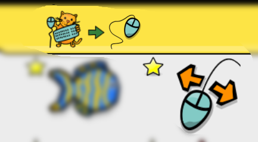 *Hýbej myší.* Děti musí pohybem myši pokrýt celou plochu obrazovky. (8 minut)

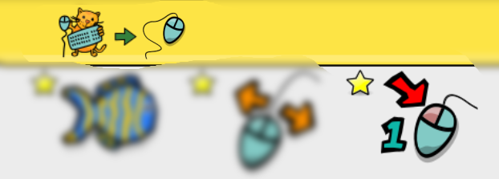 *Klikej myší.* Děti musí kliknout na různých místech plochy. Plocha na kterou mají kliknout je velká, takže motorika nemusí být tak jemná. (8 minut)

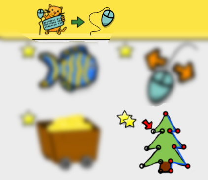 *Klikněte a kreslete.* Plocha na kliknutí je měnší a děti musí na objekty kliknout v daném pořadí. (8 minut)

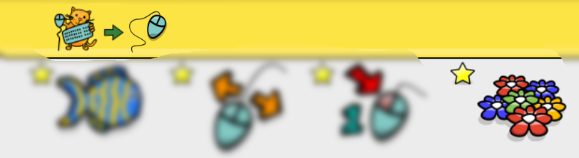 *Ovládej hadici.* Přesné táhnutí myši po klikaté dráze. (8 minut)

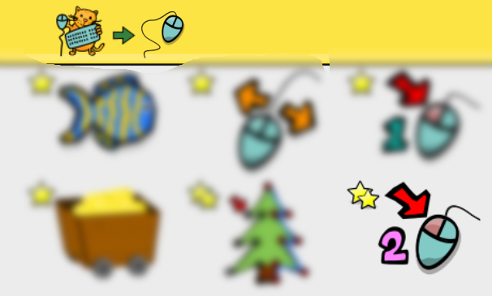 *Dvojité klikání myší.* Nácvik dvojkliku na velkých tlačítkách. (8 minut)

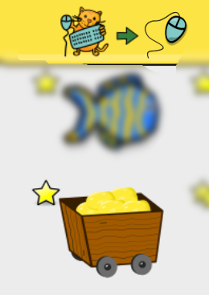 *Dolování zlata.* Procvičení skrolovacího kolečka. (8 minut)

#### Práce s klávesnicí

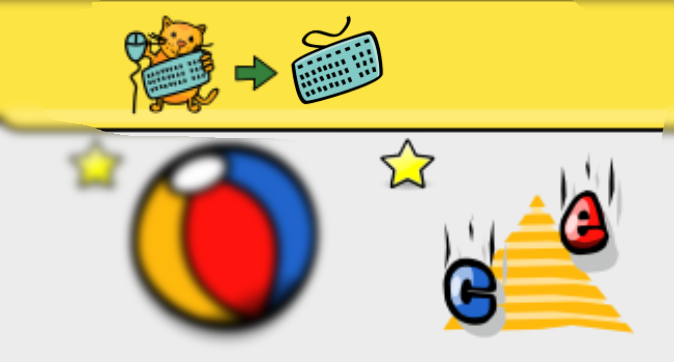 *Jednotlivá písmena.* Základy orientace na alfanumerické klávesnice. (8 minut)

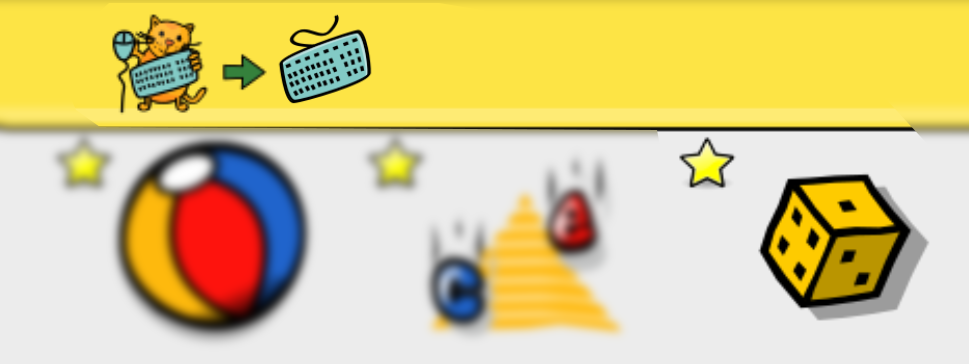 *Čísla na kostce.* Základy orientace na numerické klávesnici. (8 minut)

#### Pamětové aktivity

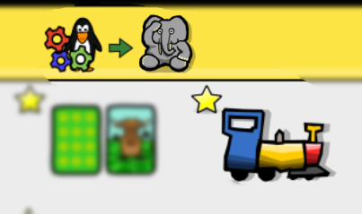 *Pamětová hra s vláčky.* Rozlišovnání vzorů a trénink krátkodobé paměti. (8 minut)

#### Prostorová orientace

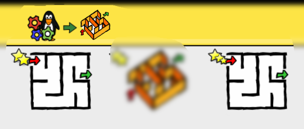 *Bludiště.* To první je jednoduší bludiště, kdy pohyb je relativní k obrazovce (šipka nahoru je pohyb nahoru po monitoru). Až to děti zvládnou tak mohou vyzkoušet druhé bludiště, kdy pohyb je relativní (šipka nahoru je pohyb vpřed, což záleží na tom kam je tučňák zrovna natočený). (2krát 8 minut).

#### Algoritmy

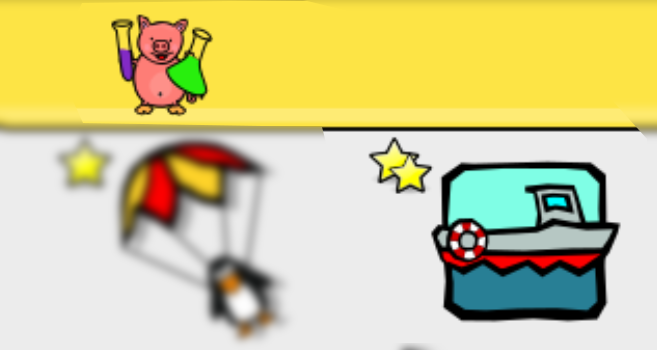 *Pracuj s plavební komorou.* Činnost je potřeba vykonat v učité posloupnosti. (8 minut)

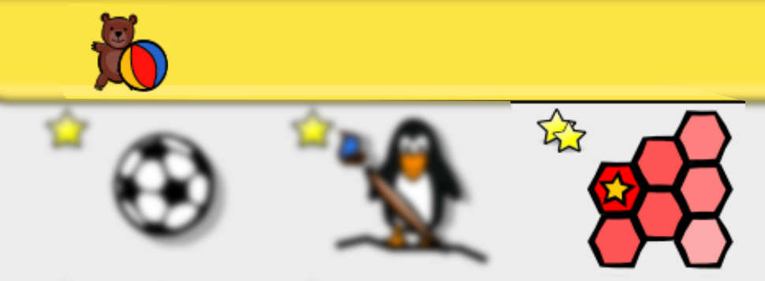 *Šestiúhelník.* Aproximace dat a postupné připbližování se k výsledku. (8 minut)

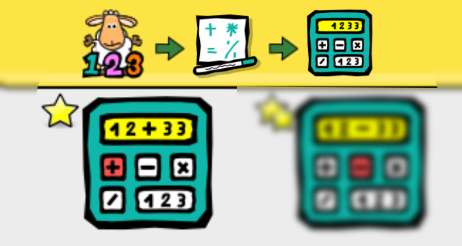 *Procvič si operaci sčítání.* Jednoduchá algebraická operace. (8 minut)

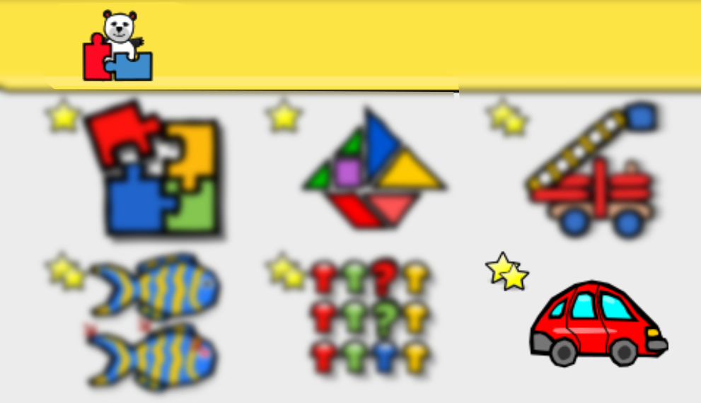 *Posouvání bloků.* Jednoduchý problém k vyřešení. (8 minut)

### Kurz 2 z Code.org

Nyní se děti mohou už vrhnout na vlastní programování. Začněte s kurzy se [Studio.Code.org](https://studio.code.org/). Nyní záleží na tom jak moc dobře děti umí číst. Pokud umí číst po písmenách, tak můžete začít rovnou u [kurzu 2](https://studio.code.org/s/course2). Zde je sice vyžadovaná znalost čtení - protože příkazy jsou napsané textově a děti je jenom přetahují. Ale příkazů není mnoho a děti mnohdy "podvádějí" a pamutují co příkaz dělá podle prvního písmena. Pokud si myslíte, že děti by to čtení nezvládli, tak můžete zkusit začít s [kurzem 1](https://studio.code.org/s/course1), který využívá intuitivních ikonek, ale jinak jsou oba kurzy velmi podobné - po jejich dokončení by děti měli chápat posloupnost příkazů a cykly.

Jelikož jsou oba kurzy obsahově podobné, tak je možné začít s prvním kurzem a v polovině přejít do poloviny (nebo třetiny) druhého kurzu.

Časová dotace je 19 hodin.

Na offline aktivity je nutné se dopředu připravit a nachystat si prostor - v některých učebnách se vám budou špatně realizovat a je možná lepší je provést v obyčejné třídě.

Kurzy na Code.org umožnují sledovat váš postup (které úlohy jste úspěšně dokončily). Ale má to háček. Buď se musíte přihlásit (více o tom níže). Nebo nesmíte mít sdílený počítač - což se ve školních učebnách téměř nedá splnit. Naopak jednoduché to je při domácí výuce, kde dítě má svůj vlastní počítač.

A jak s tím přihlašováním ve školní třídě? Nejjednodušší je zřídít každému dítěti školní email. Pokud byste zřídili email na nějakém freemailu, tak narazíte na to, že děti relativně často zapomenou své heslo a vy mu ho musíte obnovit. Což je jednak časově náročné a také musíte porušít bezpečností pravidlo (např. znáte jeho bezpečností otázku/odpověď). Pokud vaše škola nemá vlastní emaily, tak doporučuji [Google Apps for Education](https://www.google.com/edu/products/productivity-tools/), které vám umožní zprovoznit email (kalendář a další služby) na vaší školní doméně. Vy jako učitel můžete kdykoliv vytvářet libovolný počet uživatelů a lehce jim resetovat hesla. Celé to poskytuje Google zdarma a nastavení nevyžaduje velké technické dovednosti.

#### Bezpečnost na internetu

K heslu si děti musí vymyslet heslo. Nejlepší je když si vymyslí krátkou větu ze čtyř slov - např. "Moje heslo je silne", "Nas dum je zeleny". Bez diakritiky a bez speciálních znamének. Takové heslo je jednodušší k zapamatování a těžší k uhodnutí (viz [XKCD](https://xkcd.com/936/)).

Pokud chcete děti poučit o internetové bezpečnosti obecně, pak doporučuji libovolný výstup z projektu [Web Rangers](http://www.webrangers.cz/).

### Scratch

Jedno z nejlepších programátorských prostředí pro ději je bezesporu [Scratch](https://scratch.mit.edu/). Program se tvoří stejnou metodou skládání bloku jako v Code.org. Akorát příkazy už jsou mnohem obecnější a pestřejší, takže lze vytvořit velkou škálu programů, které už mají i smyslupnou činnost.

Programy můžete vytvářet buď přímo na stránce na adrese [scratch.mit.edu/projects/editor/](https://scratch.mit.edu/projects/editor/). Bohužel webová verze vyžaduje nainstalovaný Flash, který se v dnešní době nedoporučuje mít nainstalovaný, protože je s ním spojeno mnoho bezpečnostních problémů. Je možné si stáhnout a nainstalovat [offline editor](https://scratch.mit.edu/scratch2download/). Starší verze (1.4) jsou běžně součástí většiny linuxových distribucí.

Na stránkách [ScratchEd](http://scratched.gse.harvard.edu/) je mnoho příkladů a materiálu pro učitele.

Uvedu zde několik vhodných úloh pro prvňáky. Samozřejmě se nekladou meze různým variacím, které vás napadnou. Každou z těchto úloh jsou schopni děti naprogramovat zhruba za jednu vyučovací hodinu.

* [Kocourek běhá za kurzorem myši](examples/scratch/01-kocour_za_mysi.sb)
* [Kocourek je ovládaný šipkami na klávesnici](examples/scratch/02-kocourek-ovladany-sipkami.sb)
* [Míček poletuje mezi stěnami a odráží se](examples/scratch/03-micek-se-odrazi.sb)
* [Dvě postavičky spolu mluví](examples/scratch/04-povidani.sb)
* [Čaroděj co začaruje jinou postavičku](examples/scratch/05-carodej-caruje.sb)
* [Nakreslí si labyrint, zmenšený kocourek je ovládán šipkami a má projít bludištěm](examples/scratch/06-labyrint.sb)
* Míček padá shora a kocourek ho chytá; pohybuje se vlevo a vpravo podle pohybu myši
* kocourek kope balón přes překážku do branky
* chodec se vyhýbá autům (variace na The Frog), včetně počítání skóre
* variace na Nibbles (žížaly)

### Lightbot

[Lightbot](https://lightbot.com/) jednoduše ovládané programování, kde nepotřebujete ani číst ani psát. Takže je vhodné i pro předškolní děti. [Na webu je dostupné](https://lightbot.com/hocflash.html) jenom několik úrovní v rámci projektu [Hour of Code](https://hourofcode.com/cz) - zbytek je dostupný především na iPadu a Androidu. Základní úrovně zdarma, pokročilé za cenu cca 90 Kč. Takže je to spíše vhodnější pro rodiče, kteří si Lightbota mohou nainstalovat na svůj telefon a nabídnout dětem jako hru při čekání u doktora, na vlak apod.

### The Foos

Z podobného soudku jako Lightbot je i [The Foos](http://thefoos.com/). Odlehčenou verzi je možné hrát přímo v internetovém prohlížeči, ale plnohodnotnou verzi je nutné hrát na tabletu (iPad nebo Android). Hra je zdarma, ale obsahuje možná až moc gamifikace, takže se dle mého názoru na školní výuku nehodí a opět je to spíše vhodný doplněk na domácí hraní-programování.

## 2. třída

### Kurz 3 z Code.org

[Kurz 3 z Code.org](https://studio.code.org/s/course3) navazuje na [kurzu 2](https://studio.code.org/s/course2), ale obsahuje 21 hodin. Což je docela hodně (2/3 školního roku) a děti to nebude tak dlouho bavit, takže je vhodné to prokládat jinými aktivitami. Takže realně asi stihnete dodělat tak polovinu tohoto kurzu.

### CodeCombat.com

[CodeCombat](https://codecombat.com/) vypadá jako hra na hrdiny. Akorát neovládáte hrdinu přímo, ale jeho pohyb a souboje musíte naprogramovat. Už se neprogramuje přetahováním bloků jako ve Scratchi a Code.org, ale žáci píší příkazy přímo na klávesnici. Příkazy jsou anglicky, ale funguje tam automatické doplňování, která vyváží případnou nejistotu žáků. Prostředí, zadání a příklady jsou většinou česky (aktuálně je přeloženo 33% - [pomoc s překladem](http://codecombat.com/i18n/) je vítaná). Programuje se už v konkrétním jazyku. Doporučuji začít s jazykem Python, na který můžete později snadno navázat. Kromě Pythonu je možné použít JavaScript, Lua, CoffeeScript, Clojure a Io. 

V druhé třídě asi stihnete pouze první úrověň "Kobka Kithgardu", který se skládá asi z 20 úkolů a pokrývá základní syntaxy, metody, parametry, řetězce, cykly a proměnné. Za jednu vyučovací hodinu žáci stihnou tak 2 až 3 úkoly. Takže časová dotace jedné úrovně je tak 6 hodin.

Hra je zdarma. Za 9,90 USD mesíčně se vám otevře cca 7 úkolů na každé úrovni (a dostane 3500 drahokamů), ale pro potřeby výuky je to naprosto zbytné. CodeCombat nabízí i učitelské prostředí, které umožní sledovat postup žáků. Dříve to stálo 4 USD za žáka, což bylo docela únosné. Nedávno to změnili na 49 USD za žáka, což je už dle mého názoru neúnosné. A při výuce se lze bez tohoto obejít.

### Lego WeDo

[Lego WeDo](https://education.lego.com/en-us/products/lego-education-wedo-construction-set/9580) je sada s motorkem a několika sensory. A je možné ji kombinovat s běžnými Lego kostky. Sada je vhodná pro děti od 7 let. Nemám dobré zkušenosti s tím, když je více dětí na jednu sadu. A pořízení jedné sady pro každé dítě v učebně je poměrně nákladné - základní sada stojí cca 4000 Kč. V ČR lze zakoupit od [Eduxe](http://www.eduxe.cz/mladsi-skolni-vek/robotika-wedo/)

Ovládání a programování lze buď z potřeba buď z proprietárního WeDo software. Což stojí další 2500 Kč za licenci (9500 Kč pro celou učebnu). Nebo můžete použít na [programování WeDo program Scratch](http://wiki.scratch.mit.edu/wiki/LEGO%C2%AE_WeDo%E2%84%A2_Construction_Set#LEGO_WeDo_with_Scratch_2.0). Což je asi i vhodnější neb pro děti intuitivnější. Scratch verze 1.4 neumí ovládat světelné bloky.

K dispozici je [8 návodů zdarma](http://www.eduxe.cz/download/wedo-aktivity/).

Pozn: i když je fyzicky možné připojit k počítači více prvků, tak použitý protokol neumožnuje pracovat s více než dvěma prvky. Takže např. motor a jeden sensor nebo dva sensory, ale už ne motor a dva sensory.

## Další zdroje

Zde uvádím odkazy na další zdroje na které jsem narazil s mým krátkým komentářem.

[Baltík](http://www.sgpsys.com/cz/) - program, který byl vzorem pro Scratch. Bohužel je dostupný jenom pro Windows. Jeho ovládání je mnohem složitější a v licence je poměrně drahá.

[Kano](http://eu.kano.me/) - Počítač postavený na RaspberryPi. Přijde rozložený a dítě si ho musí samo složit (8 letá dcera to zvládla).  K počítači je přiložená speciální Linuxová distribuce, která se umí sama aktualizovat. Je tam několik her, které si mohou děti zahrát a následně průvodce, kteří je povedou k tomu si tu hru naprogramovat. Samozřejmě obsahuje i např. Scratch a internetový prohlížeč a je možné ho používat jako normální počítač.

[Blockly](https://developers.google.com/blockly/) - knihovna pro vizuální programování jako je Code.org a Scratch. Pomocí Blockly můžete vytvářet vlastní kurzy podobně jako na Code.org. Ale i složitější rozhraní jako je např. programování jednočipů nebo telefonů.

[MIT App Inventor](https://developers.google.com/blockly/) - je webové aplikace vytvořená pomocí Blockly, která vám umožní vizuálním stylem vytvořit aplikace pro telefony a tablety s Androidem.

