# Programování pro děti

Příručka pro pedagogy a rodiče o výuce programování dětí na prvním stupni (tj. věk 6 až 11 let).

Ke stažení na https://github.com/xsuchy/programovani_pro_deti

## Obsah

* [O příručce](#o-příručce)
  * [Licence](#licence)
* [Věk žáků](#věk-žáků)
  * [Předškolní děti](#předškolní-děti)
* [Velikost třídy](#velikost-třídy)
* [Učebna a pomůcky](#učebna-a-pomůcky)
* [Organizace výuky](#organizace-výuky)
* [Začátky](#začátky)
  * [Cubetto](#cubetto)
  * [Bee Bot](#bee-bot)
  * [GCompris](#gcompris)
* [Offline aktivity](#offline-aktivity)
  * [Deskové hry](#deskové-hry)
* [1. rok](#1-rok)
  * [Kurz 2 z Code.org](#kurz-2-z-codeorg)
    * [Něco o heslech](#něco-o-heslech)
  * [Umíme Programovat](#umíme-programovat)
  * [Scratch](#scratch)
  * [Lightbot](#lightbot)
  * [Run Marco](#run-marco)
  * [Ozobot](#ozobot)
* [2. rok](#2-rok)
  * [Kurz 3 z Code.org](#kurz-3-z-codeorg)
  * [Code Combat](#code-combat)
  * [Lego WeDo](#lego-wedo)
  * [BBC Micro:Bit](#bbc-microbit)
  * [MeetEdison](#meetedison)
* [Hry na telefon](#hry-na-telefon)
  * [Pro předškolní děti](#pro-předškolní-děti)
  * [Pro školní děti](#pro-školní-děti)
* [Další zdroje](#další-zdroje)
  * [Lego](#lego)
  * [Bezpečnost na internetu](#bezpečnost-na-internetu)
  * [Konference](#konference)
  * [Soutěže](#soutěže)
* [Stručný přehled](#další-zdroje)
* [Volnočasové kroužky](#volnočasové-kroužky)

## O příručce

Tento text není a nebude učebnicí programovaní a není pro děti. Slouží pro rodiče, vedoucí programátorských kroužků a pro učitele informatiky. Je o tom jak učit malé děti programovat, jak je naučit algoritmizovat a pochopit základní programátorské dovednosti. Není to ani příručka, podle které by se dalo postupovat krok za krokem, protože každé dítě a každá třída je vysoce individuální. Zkusím zde popsat různé možnosti výuky a jejich kombinace a uvést nezbytné detaily, které vám umožní vytvořit si vlastní učební plán. Jedná se zkušenosti mé i o zkušenosti dalších učitelů a rodičů. A samozřejmě uvítám, pokud se se mnou podělíte o svoje zkušenosti. Můžete mi psát na miroslav@suchy.cz. Stejně tak budu rád když mi dáte vědět, zda jste tuto příručku použili a jak se vám líbila.

Nemám potřebu vytvářet nějaký nový učební systém na programovaní. Už jich existuje plno. Budu zde na ně uvádět odkazy. A budu je také odstraňovat tak jak budou některé z nich zanikat a jiné místo nich vznikat. Pokud naleznete nějaký skvělý výukový program, tak budu rád když mi dáte vědět.

Oficiální učebnice a výukové materiály pro ZŠ a SŠ najdete na [iMyšlení](http://imysleni.cz/ucebnice-a-vyukove-materialy/).

Chtěl bych poděkovat mému zaměstnavateli, firmě [Red Hat](https://www.redhat.com/), díky jehož podpoře jsem měl dostatek času sepsat tuto příručku. Také bych chtěl poděkovat svým spolupracovníkům, kteří mi pomáhali na workshopech, které jsme pro děti a učitele pořádali.

### Licence

 Toto dílo podléhá licenci [Creative Commons Uveďte původ 4.0 Mezinárodní License](http://creativecommons.org/licenses/by/4.0/).

## Věk žáků

Tento text je zaměřen na děti v prvních ročnících základních škol.

První úlohy nevyžadují ani znalosti čtení ani psaní, takže jsou vhodné i pro děti z posledních tříd mateřských škol.

Pokud hledáte příručku pro střední školy, případně poslední ročníky základních škol, tak vám doporučuji [Informatiku pro každého](http://popelka.ms.mff.cuni.cz/~lessner/mw/index.php/U%C4%8Debnice/%C3%9Avod/P%C5%99edmluva_pro_u%C4%8Ditele), která je pro starší děti vhodnější.

Pokud jste dospělák a hledáte jak začít sami, tak vám doporučuji spíše materiály z [Python.cz](http://naucse.python.cz/), kde jsou i odkazy na kurzy. A pro ženy pořádá plno kurzů [Czechitas](http://www.czechitas.cz/).

### Předškolní děti

U dětí ve věku 5 let a méně zřejmě nelze programování resp. algoritmizaci vyučovat, protože dle [Piageta](https://cs.wikipedia.org/wiki/Jean_Piaget) se nacházejí ve stádiu "názorového (prelogického) myšlení", kdy plně nerespektují logiku. Názorně to můžete vidět na tomto [experimentu](https://www.youtube.com/watch?v=tQLpysTbFso). Toto období dle Piageta trvá až do 7 let. Ale dle mé osobní zkušenosti je možné začít pracovat s nadanými žáky již kolem 5-6 roku. Je nutno dbát na použití pomůcek, které mají okamžitou vizuální vazbu. Např. GCompris pro seznámení se s ovládáním počítače (viz dále) nebo Cubetto či BeeBot.

## Velikost třídy

Zatímco na střední škole lze zvládnout výuku s poloviční třídou (cca 15 dětí), tak menší děti jsou živější a osobně mi přišlo 8 dětí na třídu jako limitní množství. Optimum se mi zdá cca 6 dětí na třídu. Resp. na jednoho učitele. Jelikož děti zpracovávají úlohy samostatně, je možné postavit třídu o 30 dětech na které budou 4 učitelé (resp. kombinace učitel a asistent).

Tato velikost byla ověřena mnoha lektory v různých třídách a kroužcích. Při více jak osmi dětech na lektora se výuka stává frontální. Musí se postupovat v jednotném tempu a čekat na nejslabšího žáka ve třídě a děti taková výuka nebaví.

## Učebna a pomůcky
 
Příručka počítá s počítačovou učebnou. Většinou stačí libovolný OS, protože se bude používat pouze internetový prohlížeč. Pokud se používá nějaká aplikace, tak jsem se snažil vybrat takovou, kterou lze nainstalovat jak na Linux, Apple, tak i na Windows.

## Organizace výuky

U každé úlohy se snažím uvádět časovou dotaci tak, abyste si mohli vytvořit vlastní učební plán. Časová dotace je uváděnná pro 6-8 leté žáky. Pro starší děti můžete tento čas podělit dvěma.
Čerství prvňáci ještě nejsou zvyklí udržet pozornost delší dobu, takže první úlohy jsou extrémně krátké a často se střídají.
U druháků jsem narazil na to, že po 3 měsících už je jedno programovací prostředí nudilo, ačkoliv ještě nevyčerpali jeho možnosti. Tomu je vhodné předcházet a raději častěji měnit programovací prostředí a později se k nim opět vracet.

Ačkoliv dělím příručku pro různé věkové třídy, tak toto dělení rozhodně není závazné. A pokud to děti bude bavit, tak můžete samozřejmě používat úlohy určené jak pro mladší, tak i pro starší děti. Většinou to nebude vadit.

Teoreticky je možné postavit celou výuku nad jedním programem. Například lekce v Code.org vám vystačí určitě na celé pololetí. Možná i na celý školní rok. I když se hádanky stupňují a jsou stále těžší, děti stejné prostředí přestane brzy bavit a chtějí zkusit něco jiného. Kdy se tak stane, záleží na konkrétní třídě. Někdy dříve, někdy později. Počítejte průměrně tak po druhé až třetí hodině. Doporučuji vnímat signály od třídy a zavčas zařadit do výuky něco jiného. Rozbít tak monotónost. Není problém se později opět vráti k tomu samému prostředí (např. zmiňované Code.org). Opět tam strávit dvě až tři hodiny a pak se zase přesunout jinam.

## Začátky

V této kapitolce jsou prvky, které zvládnou úplní začátečnící. Např. Cubetta jsem úspěšně vyzkoušel s předškolní skupinou v mateřské školce. Žákům na prvním stupni ZŠ zařazuji tyto prvky na zpestření během prvního pololetí. Jakkoliv se jedná o atraktivní věci, tak jsou velmi jednoduché a děti velmi rychle omrzí. Takže např. s Cubettem a dětmi z prvního stupně je vidět na začátku hodiny velké nadšení, ale na konci hodiny už mohou být viditelné příznaky blížící se nudy.

### Cubetto

[Cubetto](https://www.primotoys.com/) je robot-želva programovaný zasouváním fyzických kostiček do dřevěného rámu. Žádná obrazovka, žádna klávesnice. Jenom dřevo a plast. [Návody do hodin](https://www.primotoys.com/resources/).

Do dřevěné ovládací desky se vkládají plastové bloky (malé destičky), které mají tvar šipek (rovně/vlevo/vpravo) a po jejich vložení a zmáčknutí tlačítka Start se robot Cubetto vydá zadaným směrem. Neexistují zde podmínky ani cykly. Vše je maximálně intuitivní. Robot vykonává příkazy postupně a na ovládácí desce vždy svítí světélko pod blokem, který je zrovna robotem vykonáván.

Na ovládací desce je místo na 12 příkazů. Plus funkční blok na 4 příkazy. Na vyvolání funkce slouží modré bloky. Při spuštění funkce svítí světlo pod modrým blokem i pod právě vykonávaným blokem v té funkci, což umožní dětem vizuálně pochopit jak fungují funkce nebo dokonce rekurze. Funkční blok samozřejmě není vhodný pro předškolní věk, ale je možné se ke Cubettovi vráti později během prvního stupně ZŠ.

Pro úplnost dodám, že existují dva další bloky (byli distribuovány jako prémie za financování na Kickstarteru): blok negace a blok náhodného příkazu.

Ke Cubettovi se dodávají hrací plátna, po kterých se Cubetto může pohybovat - jeden jeho krok, je přesně jeden čtverece na plátně. V robotovi není žádné optické čidlo, které by rozpoznávalo něco na tomto plátně. Cubetto se může stejně dobře pohybovat po čisté zemi nebo po papíru, který si pokreslíte sami. Plátna od Primotoys vám akorát ulehčí vymýšlení příběhů. Můžete zadávat úlohy "dojdi ze zámku na kopec, ale vyhni se vodě", "dojdi od sfingy k pyramidě" nebo "dojdi z planety na hvězdu, ale vyhni se sopce a meteorům".

Cubetta je možno zakoupit buď od [vyuka-vzdelavani.cz](https://www.vyuka-vzdelavani.cz/cubetto.html). Je poměrně drahý. Pro základní školy bude asi vhodnější Bee Bot, ale pro mateřské školy, ale to zřejmě jediné rozumně fungující pomůcka. Existují i levnější hračky podobného principu, ale co jsem vyzkoušel, tak mají problémy s otočením o přesně 90°, takže po několika krocích jedou úplně mimo.

[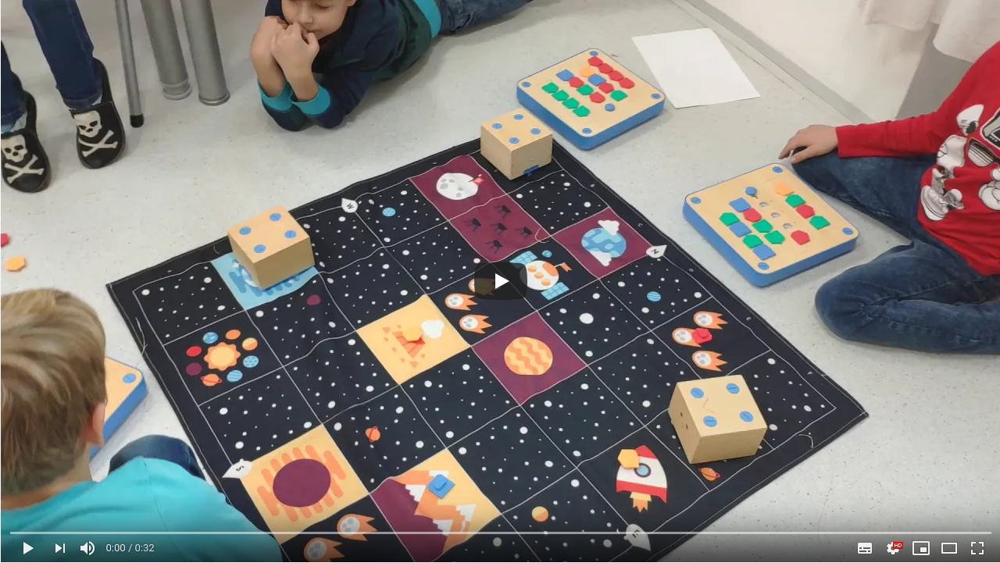](http://www.youtube.com/watch?v=JWHUiYpsbnI "Cubetto video")

Na kroužcích se mi osvědčila práce ve dvojcích. Několik příkladů:

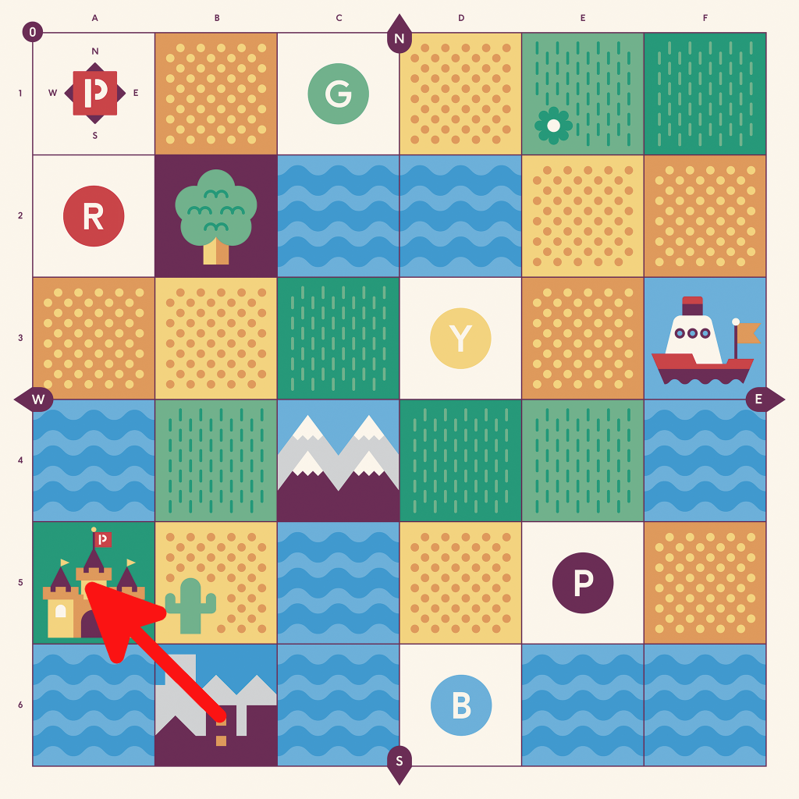
Jednoduchý posun, otočení a posun. Zde si děti obvykle ujasní, že otočení je na místě a neznamená to úkrok.

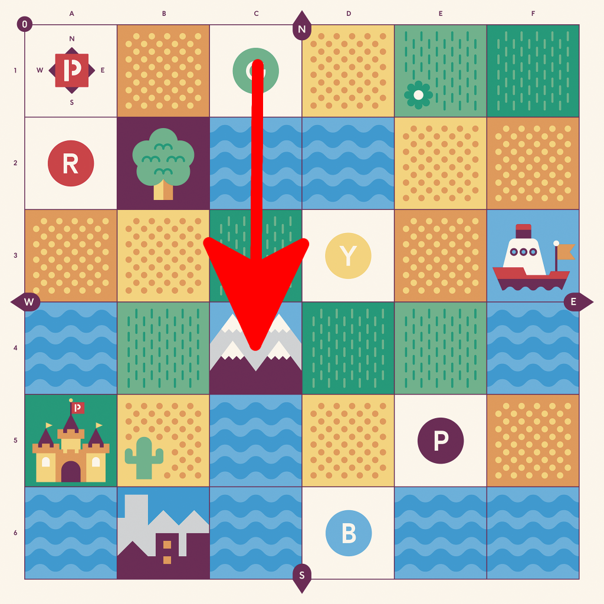
Přesuň se z "G" na "hory", ale vyhni se "vodě". Děti si musí najít vlastní cestu a zjistí, že je více než jedna možná cesta. Po této úloze je obykle nechám vzájmně si zadávat úkoly: kam se mají dostat a čemu se vyhnout nebo přes co musí projet.

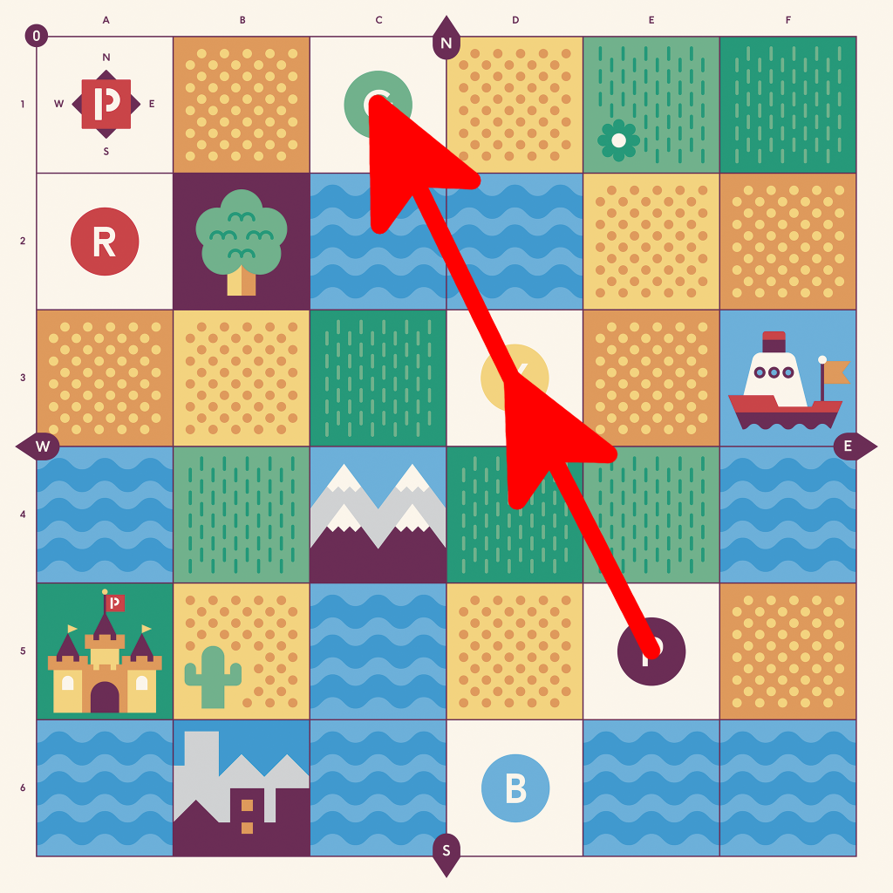
Rébus: mají dostat Cubetta z "P" na "Y", ale takovým způsobem, že až tam Cubetto dojede, tak po zmáčknutí modrého tlačítka se (bez lidského zásahu) dostane na "G". Zde si musí přijít na to, že ačkoliv se jedná o stejný program, tak Cubetto musí být i ve stejné startovní pozici (tj. po dojetí se musí ještě natočit).

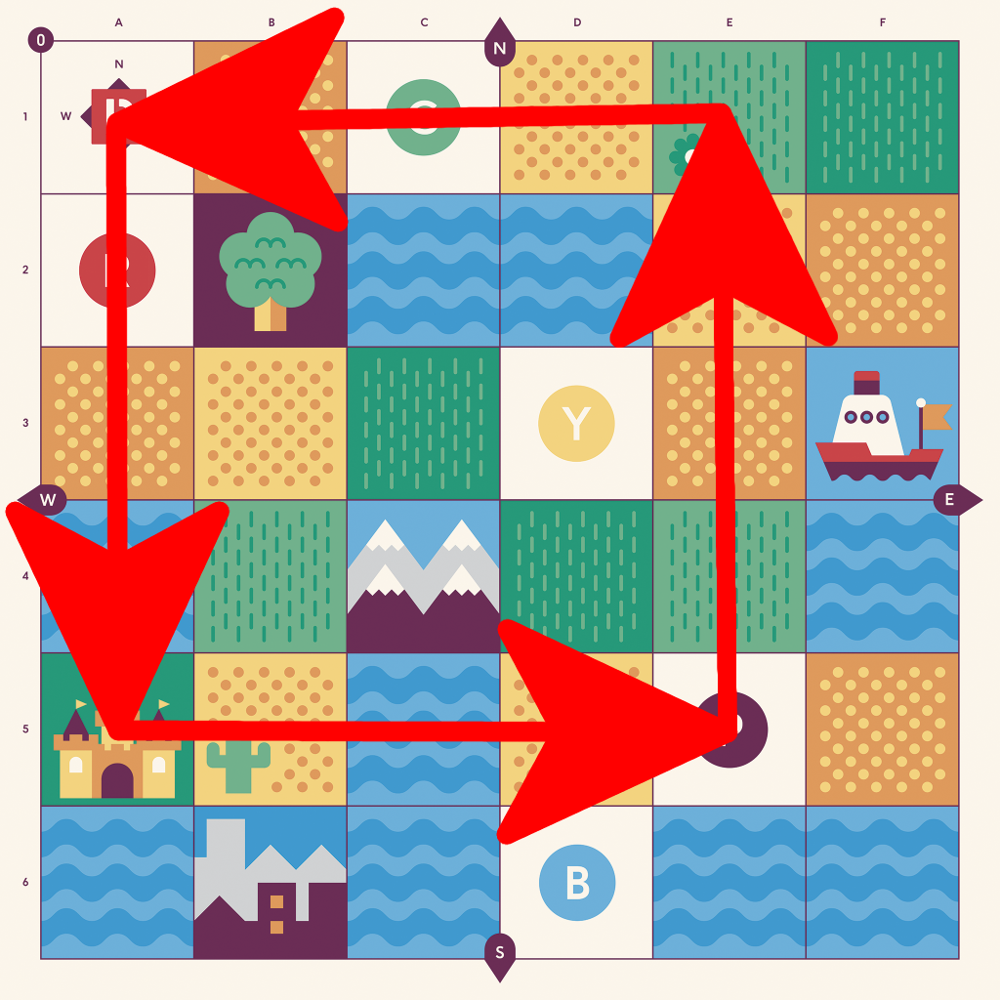 
Ať děti zkusí obkroužit čtverec 4x4. Zjistí, že jim nestačí dílky a místo na ovládácím panelu. Super přiležitost ukázat funkční blok a ukázat jak uspoří místo.

### Bee Bot

[Bee Bot](https://www.bee-bot.us/) - robot-včelka. Programuje se stisknutím tlačítek na zádech a po stisknutí zeleného tlačítka se příkazy vykonají.

[Původní Bee Bot](https://www.bee-bot.us/beebot.html) je možné programovat pouze tlačítky na zádech včelky. Zvládne až 40 příkazů. A po položení na zem a stisku tlačítka "Go" se rozjede a pohybuje se v zadaných směrech.

[Blue Bot](https://www.bee-bot.us/bluebot.html) funguje stejně, ale navíc ho můžete ovládat přes Bluetooth. Buď přes [TacTile Reader](https://www.bee-bot.us/bee-bot/accessories/tactile-reader.html) nebo z tabletu (iPad, Android) nebo z PC (Mac, Windows). S TacTile Reader dostanete základní sadu kartiček (dopředu, dozadu, otočit se) a pak Blue Bot funguje stejně jako Cubetto. Sice nemá funkční blok, ale můžete propojit více TacTile čteček za sebe pomocí přiloženého kabelu a vytvářet delší programy. V [rozšičující sadě kartiček](http://www.tts-group.co.uk/blue-bot-tactile-reader-tiles-extension-pack/1009828.html) naleznete mj. kartičku opakování a závorky - ty vám umožní dát kus kódu do závorek a opakovat tu závorku. Např. `[ vpřed vlevo ] x4`.

Osobně mi přijde vizuální zpětná vazba lepší u Cubetta, ale Bee-Bot dokáže být levnější pokud nakupujete více kusů pro celou třídu. Výrobce je [TTS Group z UK](http://www.tts-group.co.uk/primary/ict-computing/bee-bot-blue-bot-pro-bot/), ale je to paradoxně těžké od něj objednat v malých objemech. V Česku doporučuji objednávat např. od [vyuka-vzdelavani.cz](http://www.vyuka-vzdelavani.cz/vzdelavaci-pomucky/bee-bot.html).

Velkou výhodou je, že Bee Bot a Cubetto má stejnou délku kroku, takže jejich podložky jsou zaměnitelné. Délka kroku je 15 cm. Takže velikost políčka je 15x15 cm. Můžete si tak vlastní podložky nakreslit na balící papír. Je také možnost použít [pěnové puzzle](https://www.puzzle-puzzle.cz/baby-great-penove-puzzle-cislice-a-pismena-sx-15x15-d125013).

Například na podložce Cubetta je možné s Bee Botem řešit tyto úlohy:

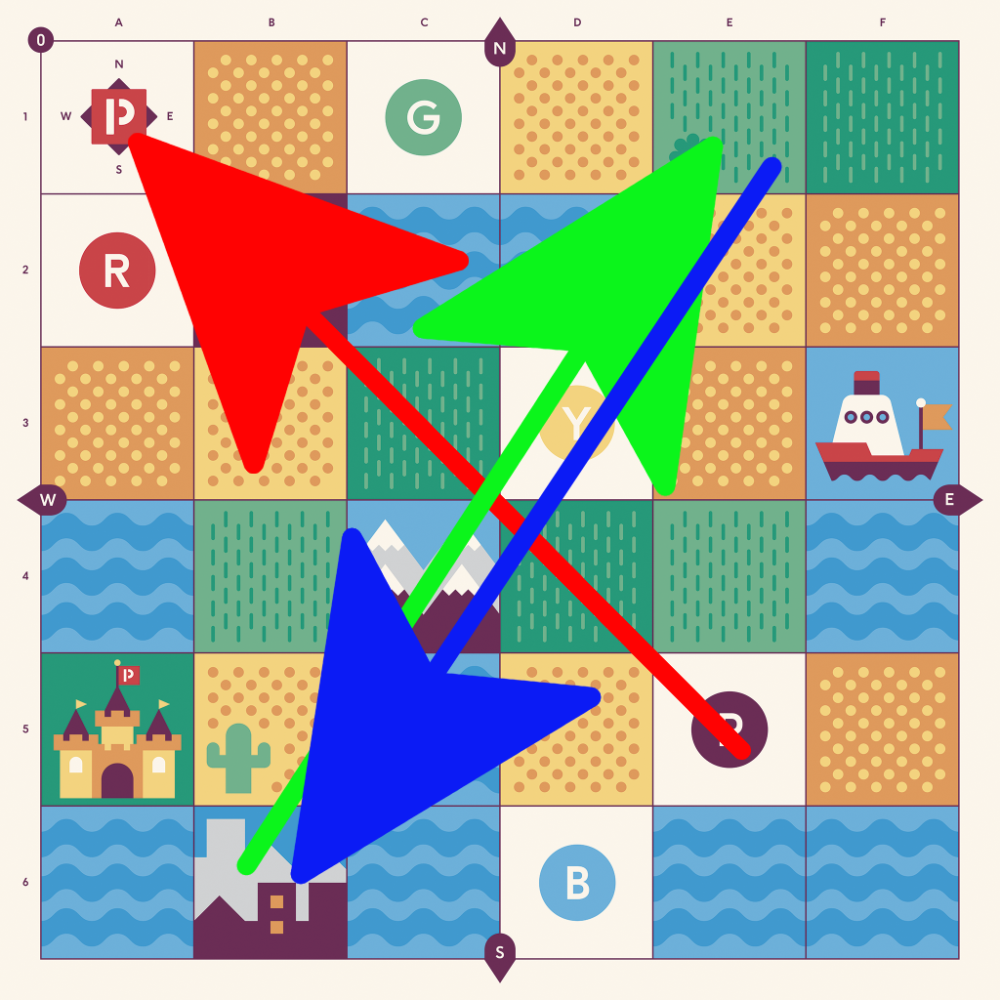
Tři včelky na jedné podložce musí vystartovat ve stejný čas. Dojít na příslušné políčko a přitom nesmí jet přes vodu nebo přes hory. A nesmí se srazit. Pokud žák hlásí, že on už má program hotový, ale jeho spolužáci ne, tak jim zdůrazněte, že záleží na celku a musí být všechny programy vpořádku. Ať poradí spolužákům (ale neprogramuje za ně). Tak aby celý tým splnil úkol. Nápověda: při tomto úkolu je vhodné použít pauzy. Jako výzvu je možné udělat stejné zadání, ale bez použití pauzy.

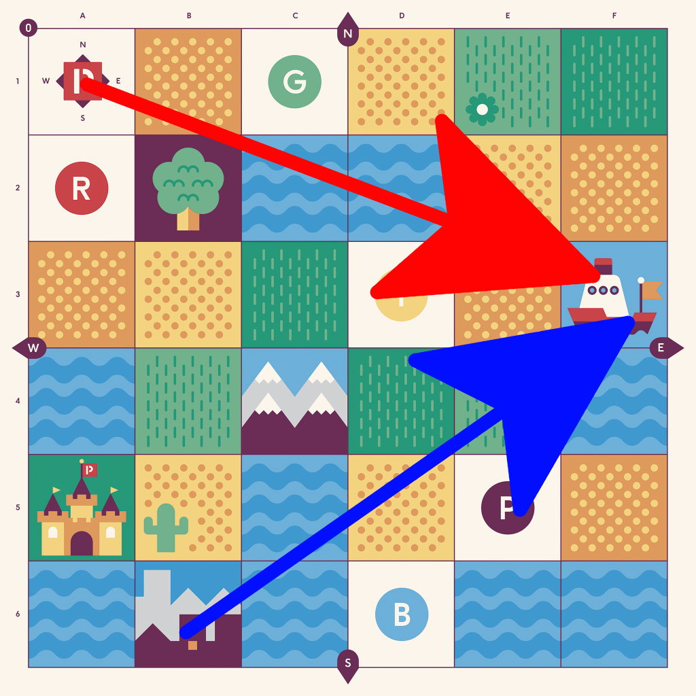
Dvě včelky vyrazí ze svého místa a musí dojít na parník a zpět. Přitom se musí vyhnout vodě a samozřejmě do sebe nesmí narazit.

[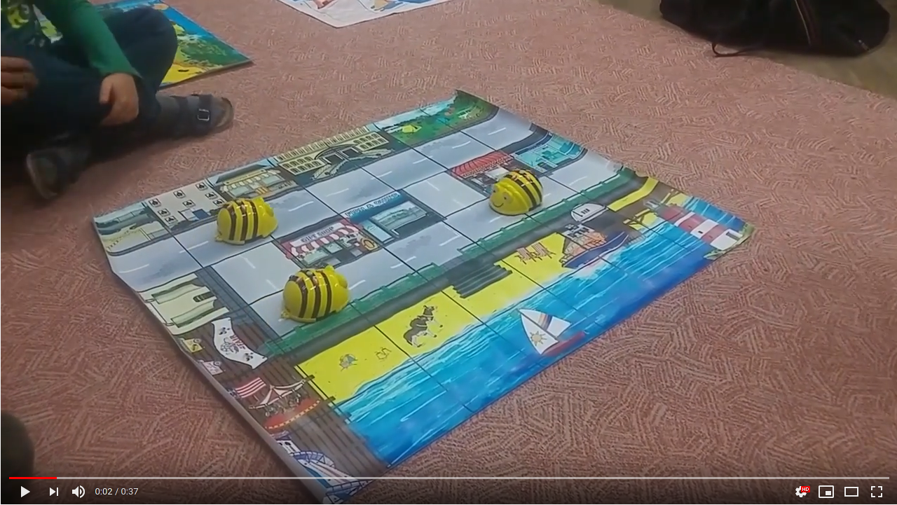](http://www.youtube.com/watch?v=KAwW8uFiwKw "BeeBot video")

### GCompris

Program [GCompris](http://gcompris.net/index-cs.html) obsahuje mnoho edukačních úkolů pro děti ve věku od 2 do 10 let. Je ideální pro seznámení s počítačem a jeho ovládáním.

Instalace:
* Fedora: `dnf install gcompris-qt`
* Ubuntu: `apt-get install gcompris-qt`
* Windows: http://gcompris.net/download/
* MacOS: https://itunes.apple.com/us/app/gcompris-educational-game/id1019161041
* Android: https://play.google.com/store/apps/details?id=net.gcompris

Program je k dispozici zdarma.

Počítejte s časovou dotací cca 5 minut na jednu úlohu. Vždy si zopakujte dvě starší lekce z předchozí hodiny (dle vlastního uvážení) a pak 3-5 nových.

GCompris je možné využít i kdykoliv později při výuce programování - např. když čekáte až přijdou všichni žáci nebo když žák skončí dříve - v tomto případě dětem říkám, že si můžou zahrát něco z "tučnáka" (což je ikona programu GCompris) dle vlastní volby.
Pokrytí vybraných lekcí z GComprisu byste měli zvládnout za 2 vyučovací hodiny.

GCompris má administrativní rozhraní, kde můžete nastavit, které úlohy budou žáci vidět a které jim zůstanou skryty. Osobně jsem ale nechával vše odemčené, a žáci si rychle našli úlohy, které odpovídaly jejich aktuálním znalostem a schopnostem.

#### Práce s myší

 *Hýbej myší.* Děti musí pohybem myši pokrýt celou plochu obrazovky. (8 minut)

 *Klikej myší.* Děti musí kliknout na různých místech plochy. Plocha, na kterou mají kliknout, je velká, takže motorika nemusí být tak jemná. (8 minut)

 *Klikněte a kreslete.* Plocha na kliknutí je menší a děti musí na objekty kliknout v daném pořadí. (8 minut)

 *Ovládej hadici.* Přesné táhnutí myši po klikaté dráze. (8 minut)

 *Dvojité klikání myší.* Nácvik dvojkliku na velkých tlačítkách. (8 minut)

 *Dolování zlata.* Procvičení skrolovacího kolečka. (8 minut)

#### Práce s klávesnicí

 *Jednotlivá písmena.* Základy orientace na alfanumerické klávesnici. (8 minut)

 *Čísla na kostce.* Základy orientace na numerické klávesnici. (8 minut)

#### Pamětové aktivity

 *Pamětová hra s vláčky.* Rozlišování vzorů a trénink krátkodobé paměti. (8 minut)

#### Prostorová orientace

 *Bludiště.* To první je jednodušší bludiště, kdy pohyb je relativní k obrazovce (šipka nahoru je pohyb nahoru po monitoru). Až to děti zvládnou, tak mohou vyzkoušet druhé bludiště, kde pohyb je relativní (šipka nahoru je pohyb vpřed, což záleží na tom, kam je tučňák zrovna natočený). (2krát 8 minut).

#### Algoritmy

 *Pracuj s plavební komorou.* Činnost je potřeba vykonat v určité posloupnosti. (8 minut)

 *Šestiúhelník.* Aproximace dat a postupné přibližování se k výsledku. (8 minut)

 *Procvič si operaci sčítání.* Jednoduché algebraické operace. (8 minut)

 *Posouvání bloků.* Jednoduchý problém k vyřešení. (8 minut)

## Offline aktivity

Je dobré občas proložit hodinu offline aktivitou. Zde naleznete [seznam nápadů na offline aktivity na Code.org](https://code.org/curriculum/unplugged). Je vhodné mít nastudovanou alespoň jednu aktivitu do zásoby, tak abyste mohli uskutečnit hodinu i když nenadále vypadne elektřina nebo internet. Některé aktivity obsahují velmi silný [aha zážitek](https://cs.wikipedia.org/wiki/Aha_efekt).

Po dvou až třech lekcích se Scratch doporučuji zařadit následující aktivitu: Děti se postaví do řady do jednoho třídy. První bude dělat kocourka ze Scratche a bude poslouchat to co mu říká žák za ním a bude to přesně vykonávat. Druhý žák má za úkol zadávat povely a dovést prvního žáka do protilehlého rohu (diagonálně). Povely musí být jednoduché - krok vpřed, otoč se vpravo... Dohlédněte aby první student vykonával příkazy přesně. Pokud v důsledku povelu má narazit do židle nebo lavice, tak by do ní měl narazit. Při této aktivitě si žáci uvědomí, že počítač vykoná přesně to co mu zadáte a nic víc. Aktivitu můžete buď zjednodušit (přejít z bodu do bodu a mezi nimi je jenom jedna židle) nebo ztížit (více překážek, hodně otoček).

Druhou aktivitou, kterou určitě doporučím je [programování na milimetrovém papíře](https://studio.code.org/s/course2/stage/1/puzzle/1). Tato aktivita málokdy vyjde. O to větší je to zážitek. Při zápisu děti velmi často vytvoří nové vlastní značky. Značky nezapisují po řádcích a zleva doprava. A pokud se to už někomu povede správně zapsat, tak druhý žák špatně zápis špatně interpretuje. Zde si žáci uvědomí, že to co je zřejmé pro ně. Nemusí být zřejmé pro druhé.

Podobné je i [How Computers Work](http://cse4k12.org/how_computers_work/index.html) kde si žáci rozdělí úlohy displeje, CPU a ALU a společně interpretují program.

Velkým zdrojem inspirace je i kniha [Computer Science Unplugged](https://classic.csunplugged.org/books/), jejíž [český překlad](http://www.ceskaskola.cz/2014/09/e-kniha-pro-vas-computer-science.html) je zdarma ke stažení.

Pro pobavení si můžete složit a hrát na [papírovém modelu počítače Zenit](http://www.papirovaarcheologie.cz/minipocitac-zenit/). Nebo [Papírový počítač CGS](http://mmm.webz.cz/pocitadla/cgs.html) - papírový simulátor registrů v počítači. Ten původně vyšel v ABC a později ve VTM. [Více informací](https://cs.wikipedia.org/wiki/Papírový_počítač_CGS).

Velmi oblíbenou aktivitou je "Přesné plnění instrukcí". Vše zřejmě odstartoval Josh Darnit. Doporučuji shlédnout jeho [playlist Exact Instructions Challenge](https://www.youtube.com/playlist?list=PL2tgThFV6OzlR3yFLtH1m8LAzzl-JVrFR). Já se inspiroval jeho [návodem jak vytvořit sendwitch](https://www.youtube.com/watch?v=cDA3_5982h8&list=PL2tgThFV6OzlR3yFLtH1m8LAzzl-JVrFR&index=2&t=0s) a natočil kousek mojí hodiny:

[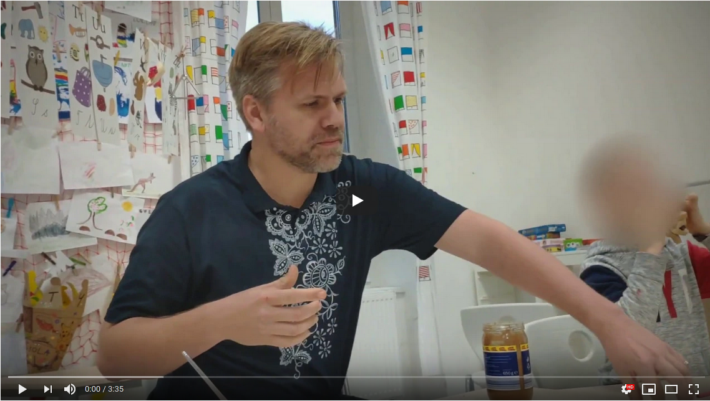](https://www.youtube.com/watch?v=RO0Mj1eahw0 "Udělej mi sendvič video")

Během jedné hodiny jsem vždy spotřeboval dvě balení chleba - nezáleží na tom, kolik máte dětí.

### Deskové hry

[RoboRally](http://www.zatrolene-hry.cz/spolecenska-hra/roborally-111/) - desková hra, kde plánujete pohyb svého robota, ale je třeba brát v úvahu pohyby robotů ostatních hráčů. Hra je sice uvedena jako 12+, ale děti, které si vyzkoušeli nějaké programování (např. Hour of Code) ji zvládají. Já ji obvykle hrávám ve zjednodušené formě, kdy ponechávám pouze pohyby po ploše a vynechávám dobíjení apod.
                                                                                                                       
[Ricochet Robots](http://www.zatrolene-hry.cz/spolecenska-hra/ricochet-robots-315/) - desková hra, která je naprosto úžasná do kroužků. Může ji hrát libovolný počet hráčů (kolik se jich vleze kolem jednoho stolu) a všichni hrají současně, takže nevzniká prostoj, kdy se děti nudí. Na začátku se náhodně rozestaví roboti na hrací ploše (takže je spoustu herních konfigurací) a pak se losuje který robot se má kam dostat. Roboti nemají brzdu, takže se mohou zastavit jenom o zeď, okraj plochy nebo o jiného robota. Takže cesta k cíli není přímočará a někdy dost komplikovaná a existuje mnoho možných cest. Hráči se všichni najednou snaží najít (nejkratší) cestu do cíle (už jsem říkal, že je to tichá hra?). Až někdo zahlásí, že našel cestu (např. na 5 tahů), tak se spustí přesípací hodiny a ještě minutu mají ostatní hráči šanci najít cestu. Buď kratší, nebo i delší pro případ, že první hráč nakonec neprokáže, že by se jednalo o správnou cestu (což se s dětmi dost často stává).

## 1. rok

V této části jsou aktivity, které dělám s dětmi během jejich prvního roku výuky. Nezáleží jestli mají 7 let. Nebo zda mají 11 roků. Je to prostě jejich první seznámení s algoritmizací.

### Kurz 2 z Code.org

V tuto chvíli se děti už mohou vrhnout na vlastní programování. Začněte s kurzy se [Studio.Code.org](https://studio.code.org/). Nyní záleží na tom, jak moc dobře děti umí číst. Pokud umí číst po písmenech, tak můžete začít rovnou u [kurzu 2](https://studio.code.org/s/course2). Zde je vyžadována znalost čtení, protože příkazy jsou napsané textově a děti je (jenom) přetahují. Ale příkazů není mnoho a děti mnohdy "podvádějí" a pamatují si, co příkaz dělá, podle prvního písmena. Pokud si myslíte, že děti by to čtení nezvládly, tak můžete zkusit začít s [kurzem 1](https://studio.code.org/s/course1), který využívá intuitivních ikonek, ale jinak jsou oba kurzy velmi podobné - po jejich dokončení by děti měly chápat posloupnost příkazů a cykly.

Jelikož jsou oba kurzy obsahově podobné, tak je možné začít s prvním kurzem a v polovině přejít do poloviny (nebo třetiny) druhého kurzu.

Časová dotace je 19 hodin.

Na offline aktivity je nutné se dopředu připravit a nachystat si prostor - v některých učebnách se vám budou špatně realizovat a je možná lepší je provést v obyčejné třídě.

Kurzy na Code.org umožnují sledovat váš postup (které úlohy jste úspěšně dokončili). Ale má to háček. Buď se musíte přihlásit (více o tom níže), nebo nesmíte mít sdílený počítač - což se ve školních učebnách téměř nedá splnit. Naopak jednoduché to je při domácí výuce, kde dítě má svůj vlastní počítač.

A jak postupovat s přihlašováním ve školní třídě? Nejjednodušší je zřídit každému dítěti školní email. Pokud byste zřídili email na nějakém freemailu, tak narazíte na to, že děti relativně často zapomenou své heslo a vy mu ho musíte obnovit. Což je jednak časově náročné a také musíte porušit bezpečností pravidlo (např. znáte jeho bezpečností otázku/odpověď). Pokud vaše škola nemá vlastní emaily, tak doporučuji [Google Apps for Education](https://www.google.com/edu/products/productivity-tools/), které vám umožní zprovoznit email (kalendář a další služby) na vaší školní doméně. Vy jako učitel můžete kdykoliv vytvářet libovolný počet uživatelů a lehce jim resetovat hesla. Celé to poskytuje Google zdarma a nastavení nevyžaduje velké technické dovednosti.

#### Něco o heslech

K emailu si děti musí vymyslet heslo. Nejlepší je, když si vymyslí krátkou větu ze čtyř slov - např. "Moje heslo je silne", "Nas dum je zeleny". Bez diakritiky a bez speciálních znamének. Takové heslo je jednodušší k zapamatování a těžší k uhodnutí (viz [XKCD](https://xkcd.com/936/)).

Pokud chcete děti poučit o internetové bezpečnosti obecně, pak doporučuji libovolný výstup z projektu [Web Rangers](http://www.webrangers.cz/).

Pokud se chcete sami poučit o heslech, tak doporučuji shlédnout [prezentaci Radomíra Orkáče - Hesla? Hesla! Hesla?](https://youtu.be/RR9CMsae9d8).

### Umíme Programovat

Na [FI MUNI](https://www.fi.muni.cz/) - vznikl projekt [Robomise](https://robomise.cz/) využívají [adaptivní učení](https://www.em.muni.cz/tema/8538-vyuzivaji-se-moderni-technologie-ve-vyuce-naplno). Robomise je sada úloh, kde máte dovést do cíle raketku a vyhnout se meteoritům. Aplikace je zdarma a mám dojem, že stále slouží studentům FI jako testovací prostředí. Jako komerční spin-off vznikl projekt [Umíme to](https://www.umimeto.org/) pod který spadá i [Umíme Programovat](https://www.umimeprogramovat.cz/). Zdarma můžete projít 150 příkladů denně. To vám stačí na soukromé použití nebo na malý kroužek. Pokud potřebujete více tak musíte mít školní licenci.

V rámci Umíme Programovat jsou dostupné různé druhy úloh. Já s dětmi začínám [Šipkovanou](https://www.umimeprogramovat.cz/sipkovana). Obrázek od Radka Pelánka, který vám pomůže s výběrem vhodné úlohy:

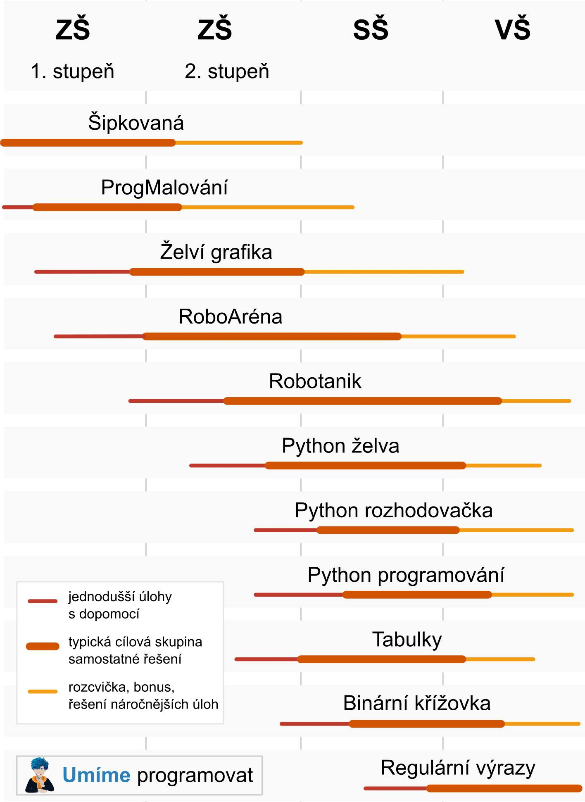

### Scratch

Jedno z nejlepších programátorských prostředí pro děti je bezesporu [Scratch](https://scratch.mit.edu/). Program se tvoří stejnou metodou skládání bloku jako v Code.org. Ovšem příkazy už jsou mnohem obecnější a pestřejší, takže lze vytvořit velkou škálu programů, které už mají i smysluplnou činnost.

Programy můžete vytvářet přímo na stránce na adrese [scratch.mit.edu/projects/editor/](https://scratch.mit.edu/projects/editor/). Nejnovější webová verze (3.0) běží ve všech moderních prohlížečích a nevyžaduje žádnou instalaci. Je možné si stáhnout a nainstalovat [offline editor](https://scratch.mit.edu/download/) včetně předchozích verzí. [Zde](https://en.scratch-wiki.info/wiki/Compatibility_of_Versions_of_Scratch) jsou oficiální systémové požadavky pro použití všech verzí. 

Na stránkách [ScratchEd](http://scratched.gse.harvard.edu/) je mnoho příkladů a materiálů pro učitele.

Uvedu zde několik vhodných úloh pro prvňáky. Samozřejmě se nekladou meze různým variacím, které vás napadnou. Každou z těchto úloh jsou schopni děti naprogramovat zhruba za jednu vyučovací hodinu.

* Kocourek běhá za kurzorem myši [[stáhnout](examples/scratch/01-kocour_za_mysi.sb)] [[online](https://scratch.mit.edu/projects/165224527/#player)]
* Kocourek je ovládaný šipkami na klávesnici [[stáhnout](examples/scratch/02-kocourek-ovladany-sipkami.sb)] [[online](https://scratch.mit.edu/projects/165225622/#player)]
* Míček poletuje mezi stěnami a odráží se [[stáhnout](examples/scratch/03-micek-se-odrazi.sb)] [[online](https://scratch.mit.edu/projects/165226697/#player)]
* Dvě postavičky spolu mluví [[stáhnout](examples/scratch/04-povidani.sb)] [[online](https://scratch.mit.edu/projects/165227369/#player)]
* Čaroděj co začaruje jinou postavičku [[stáhnout](examples/scratch/05-carodej-caruje.sb)] [[online](https://scratch.mit.edu/projects/165228299/#player)]
* Nakreslí si labyrint, zmenšený kocourek je ovládán šipkami a má projít bludištěm [[stáhnout](examples/scratch/06-labyrint.sb)] [[online](https://scratch.mit.edu/projects/165229008/#player)]
* Míček padá shora a kocourek ho chytá; pohybuje se vlevo a vpravo podle pohybu myši [[stáhnout](examples/scratch/07-pada-mic.sb)] [[online](https://scratch.mit.edu/projects/165233453/#player)]
* Kocourek kope balón přes překážku do branky [[stáhnout](examples/scratch/08-gol.sb)] [[online](https://scratch.mit.edu/projects/165234140/#player)]
* Chodec se vyhýbá autům (variace na The Frog), včetně počítání skóre [[stáhnout](examples/scratch/09-auta.sb)] [[online](https://scratch.mit.edu/projects/165234470/#player)]
* Variace na Nibbles (žížaly)

Můžete také použít [projekty](http://projects.codeclubworld.org/) z [Code Club](https://www.codeclub.org.uk/).

### Lightbot

[Lightbot](https://lightbot.com/) jednoduše ovládané programování, kde nepotřebujete ani číst ani psát. Takže je vhodné i pro předškolní děti. [Na webu je dostupné](https://lightbot.com/hocflash.html) jenom několik úrovní v rámci projektu [Hour of Code](https://hourofcode.com/cz) - zbytek je dostupný především na iPadu a Androidu. Základní úrovně zdarma, pokročilé za cenu cca 90 Kč. Takže je to spíše vhodnější pro rodiče, kteří si Lightbota mohou nainstalovat na svůj telefon a nabídnout dětem jako hru při čekání u lékaře, na vlak apod.

### Run Marco!

Velmi podobné jako Code.org je i [Run Marco!](https://runmarco.allcancode.com/) - byť trochu chudší, ale o to barevnější. Přeloženo kompletně do češtiny, ale bohužel musíte začínat vždy od začátku, takže se k tomu lze jen těžko vracet. Materiál na jednu hodinu.

### Ozobot

[OzoBot](http://ozobot.com/) je robůtek, který sleduje čáru. Různé vzory barev na čáře fungují jako příkazy, takže robůtka můžete programovat čistě tužkou a papírem. [Rezenze](https://www.youtube.com/watch?v=Aw_qJp6jm8I). [Materiály pro učitele](http://ozobot.com/stem-education/stem-lessons). Pomocí [OzoBlockly](http://ozoblockly.com/) můžete robůtka naprogramovat podobně jako ve Scratchi a program do něj flashnout blikáním přes obrazovku. ([Howto](https://www.youtube.com/watch?v=fwIrAzZfvRc)) - [materiály do hodin](https://portal.ozobot.com/lessons), [puzzle](https://edu-sense.com/pl/produkty#cat-puzzle), [české materiály](http://ozobot.sandofky.cz/), upravené [začínáme s Ozoboty](ozobot/BitEvo_edit.pdf) se zvýrazněným textem pro lepší tisk. Lze koupit ve dvou variantách: [Ozobot 2.0 Bit](https://www.vyuka-vzdelavani.cz/ozobot-bit-2-0-titanove-cerny.html), který základním modelem. Z mé zkušenosti funguje jenom pomocí kreslení čar. Programování přes OzoBlockly mi fungovalo jenom na iPadu. Kdekoliv jinde (Androdidy, monitory, laptopy) přenos po pár sekundách spadnul. Pokročilejší - a dražší - je [Ozobot Evo](https://www.vyuka-vzdelavani.cz/ozobot-evo-bily.html), který umí komunikovat přes Bluetooth, má více sensorů na sledování čar a dva infračervené sensory vpředu na detekci překážek. K dostání je bezproblému v mnoha českých obchodech. 

V praxi je třeba vychytat jaké fixy vám budou sedět. Nejjistější jsou originální fixy dodávané pro Ozobota, ale Centropeny se šikmou špičkou fungují velmi dobře. K dostání je i [dřevěné puzzle](https://www.vyuka-vzdelavani.cz/ozobot-drevene-puzzle.html) s nekreslenými čarami.

## 2. třída

Toto jsou aktivity, které s nimi dělám během jejich druhého roku seznamování s algoritmizací. Dle úvážení lektora můžete aktivitu nasadit i dříve. Zejména pokud se jedná o věkově starší žáky.

### Kurz 3 z Code.org

[Kurz 3 z Code.org](https://studio.code.org/s/course3) navazuje na [kurzu 2](https://studio.code.org/s/course2), ale obsahuje 21 hodin. Což je docela hodně (2/3 školního roku) a děti to pravděpodobně nebude tak dlouho bavit. Proto je vhodné to prokládat i jinými aktivitami. Z toho vyplývá, že stihnete dodělat asi tak polovinu tohoto kurzu.

### Code Combat

[CodeCombat](https://codecombat.com/) vypadá jako hra na hrdiny. Akorát neovládáte hrdinu přímo, ale jeho pohyb a souboje musíte naprogramovat. Už se neprogramuje přetahováním bloků jako ve Scratchi a Code.org, ale žáci píší příkazy přímo na klávesnici. Příkazy jsou anglicky, ale funguje tam automatické doplňování, která vyváží případnou nejistotu žáků. Prostředí, zadání a příklady jsou většinou česky (aktuálně je přeloženo 33% - [pomoc s překladem](http://codecombat.com/i18n/) je vítaná). Programuje se už v konkrétním jazyku. Doporučuji začít s jazykem Python, na který můžete [později snadno navázat](http://www.root.cz/knihy/make-games-with-python/). Kromě Pythonu je možné použít JavaScript, Lua, CoffeeScript, Clojure a Io. 

V druhé třídě asi stihnete pouze první úrověň "Kobka Kithgardu", který se skládá asi z 20 úkolů a pokrývá základní syntaxi, metody, parametry, řetězce, cykly a proměnné. Za jednu vyučovací hodinu žáci stihnou tak 2 až 3 úkoly. Takže časová dotace jedné úrovně je cca 6 hodin.

Hra je zdarma. Existuje možnost si připlatit, ale jelikož nedávno podražili a jejich cenová politika je netransparentní (poslední cena byla 49 USD za žáka), tak doporučuji další úrovně nedokupovat a neplatit si za učitelské prostředí, které tam existuje. Při výuce se lze naštěstí bez tohoto obejít.

### Lego WeDo

[Lego WeDo](https://education.lego.com/en-us/products/lego-education-wedo-construction-set/9580) je sada s motorkem a několika sensory. A je možné ji kombinovat s běžnými Lego kostkami. Sada je vhodná pro děti od 7 let. Nemám dobré zkušenosti s tím, když je více dětí na jednu sadu. A pořízení jedné sady pro každé dítě v učebně je nákladné - základní sada stojí cca 4000 Kč. V ČR ji lze zakoupit od [Eduxe](http://www.eduxe.cz/mladsi-skolni-vek/robotika-wedo/)

Programovat toto Lego lze buď z proprietárního WeDo software - což stojí další 2500 Kč za licenci (9500 Kč pro celou učebnu), nebo můžete použít na [programování program Scratch](http://wiki.scratch.mit.edu/wiki/LEGO%C2%AE_WeDo%E2%84%A2_Construction_Set#LEGO_WeDo_with_Scratch_2.0). Což je asi i vhodnější, protože je pro děti intuitivnější. Scratch verze 1.4 neumí ovládat světelné bloky.

K dispozici je [8 návodů zdarma](http://www.eduxe.cz/download/wedo-aktivity/).

Pozn: i když je fyzicky možné připojit k počítači více prvků, tak použitý protokol neumožnuje pracovat s více než dvěma prvky. Takže např. motor a jeden sensor nebo dva sensory, ale už ne motor a dva sensory.

Lego WeDo je nutné mít připojeno k počítači USB kabelem. Tohle omezení už neplatí pro [Lego WeDo 2.0](https://education.lego.com/en-us/products/lego-education-wedo-2-0-core-set/45300), které se připojuje pomocí Bluetooth LE. Je sice asi o 12 dolarů dražší, ale v dodávce je i ovládací SW od Lega a 40 hodin kurikula pro učitele. Možno zakoupit u [Eduxe](http://www.eduxe.cz/mladsi-skolni-vek/robotika-wedo-20/)

### BBC Micro:Bit

[BBC Micro:Bit](http://microbit.org/) - je jednočipový počítač specialně navržený pro 10+ děti. Ve Velké Británii je distribuován zdarma všem dětem v 7. třídě (odpovídá naší 5-6. třídě). Počítač vypadá jako malá destička a stojí 12 liber (cca 350 Kč). Je vybaven procesorem ARM. Obsahuje pole 5x5 diod na kterém je možné zobrazovat piktogramy nebo text. Má dvě tlačítka a 22 elektrických pinů. Navíc ještě kompas, akcelerometr, USB a bluetooth rozhraní. K počítači se připojí pomocí USB kabelu a operační systém ho vidí jako disk (mass-storage). Ve <a href="http://microbit.org/code/">webovém editoru</a> (doporučuji začít s CK Javascript nebo Microsoft Block Editor) vytvoříte program a po kompilaci si můžete stáhnout HEX soubor. Ten uložíte na ten disk (micro:bitu). Micro:bit si automaticky načte nový firmware z tohoto souboru a restartuje se. Aplikace je možné vytvářet i z mobilu (<a href="https://play.google.com/store/apps/details?id=com.samsung.microbit">GooglePlay</a>) a nahrávat bezdrátově přes bluetooth - ovšem není to moc komfortní. K dostání je v <a href="https://kitronik.co.uk/bbc-micro-bit-accessories/bbc-micro-bit.html">Kitronik</a> nebo v Česku u [Raselu](https://www.rasel.cz/qx69D/micro%3Abit), [MegaRobot](http://www.megarobot.cz/index.php?route=product/category&path=118) nebo [RPishop](http://rpishop.cz/194-bbc-microbit).

K dispozici je i mnoho rozšíření:

 * [SnapBit](https://snapbit.org/) - ovládání [Bofina](http://www.boffin.cz/) pomocí Micro:bit
 * [Qdee](https://www.hiwonder.hk/collections/microbit/products/qdee) - pásové auto ovládané Micro:bitem
 * [AlienBot](https://www.hiwonder.hk/collections/microbit/products/alienbot) - čtyřnohý pavouk ovládaný Micro:bitem
 * [uHandbit](https://www.hiwonder.hk/collections/microbit/products/uhandbit-micro-bit-programmable-robotic-hand-for-ai-learning) - mechanická ruka ovládaná Micro:bitem
 * [Inventor sada](http://www.megarobot.cz/index.php?route=product/product&path=118&product_id=418) - extension board s nepájivým polem a vynikající příručkou plnou příkladů a s potřebnými elektronickými součástky v krabici
 * [různé](http://www.megarobot.cz/index.php?route=product/product&path=118&product_id=429) [bugginy](http://www.megarobot.cz/index.php?route=product/product&path=118&product_id=425) - ale nemám s nimi moc dobré zkušenosti. Ta [první](http://www.megarobot.cz/index.php?route=product/product&path=118&product_id=429) vyžaduje pájení a u obou je netriviální zvládnout otočení o přesný úhel.
 * [mnoho různých senzorů a displejů](https://www.kitronik.co.uk/microbit.html?cat=199&limit=30) od Kitroniku. A různě po internetech i od jiných výrobců.
 * [Experiment Kit](https://www.hwkitchen.cz/bbc-microbit-experiment-kit/)

<a href="https://www.codeclubprojects.org/en-GB/microbit/">Výukové projekty</a> od CodeClub.

[Aplikace od Microla.cz](http://microla.cz/aplikace/).

[Příklady od Micro:bit.org](http://microbit.org/en/2017-03-07-javascript-block-resources/).

[Další příklady od Micro:bit.org](https://makecode.microbit.org/projects). Zejména doporučuji: [Flashing Heart](https://makecode.microbit.org/projects/flashing-heart), [Magic button trick](https://makecode.microbit.org/projects/magic-button-trick), [Banana keyboard](https://makecode.microbit.org/projects/banana-keyboard), [Guitar](https://makecode.microbit.org/projects/guitar), [Soil Moisture](https://makecode.microbit.org/projects/soil-moisture), [Plant Watering](https://makecode.microbit.org/projects/plant-watering), [Reaction Time](https://makecode.microbit.org/projects/reaction-time), [Hot Or Cold](https://makecode.microbit.org/projects/hot-or-cold), [Voting Machine](https://makecode.microbit.org/projects/voting-machine), [Infection](https://makecode.microbit.org/projects/infection), [Fireflies](https://makecode.microbit.org/projects/fireflies) a [Compass](https://makecode.microbit.org/projects/compass). Případně příklady využívající motor (nutno přikoupit): [Inchworm](https://makecode.microbit.org/projects/fireflies) a [Milk Cartoon Robot](https://makecode.microbit.org/projects/milk-carton-robot).

Moje příklady:

 * [Zobrazení ikon](https://makecode.microbit.org/_8dfAyLWpH6mX) - po stisknutí tlačítka se zobrazí ikona, text, číslo. Žáci si můžou vyzkoušet různé ikony a vytvořit vlastní obrazce. Vyzkouší si jak se nahrává program na Micro:bit.
 * [Elektronická kostka](https://makecode.microbit.org/_bit5bTWak43m) - po zatřesení z Micro:bite zobrazí číslo od 1 do 6. Výzva: Jak zajistit aby se neukazovala nula? Pro starší: Jak místo čísla zobrazit tečky jako na kostce?
 * [Temploměr](https://makecode.microbit.org/_JX3Cs63dqYVR) - po nahrání kódu do Micro:bitu, ho žáci mohou odpojit od počítače a napojit na baterky a zjisti jak se teplota bude měnit, pokud ho zahřejí dechem. Jaká je teplota venku a jaká v ledničce.
 * [Animace](https://makecode.microbit.org/_K84UV2cqiegM) - zobrazit animaci padajících kapek. Žáci si mohou vytvořit vlastní animaci: auto, skakajicí míč...
 * [Krokoměr](https://makecode.microbit.org/_U50gtMc89a14) - práce s proměnnou. Co se stane pokud zobrazím proměnnou hned po té co ji inkrementuji? (začnu ztrácet kroky po dosažení desítky, protože další otřes se bude počítat až po dorolování čísla). Opět je možno přepojit na baterie a zkoušet přesnost měření.
 * [Měření světla](https://makecode.microbit.org/_1raTgrEF9fDP) - práce s podmínkou. Jaké je vhodné číslo aby se smajlík změnil při pouhém zakrytí světla? Výzva: zobraz různé obrázky pro různou intenzitu světla nebo tmy.
 * Stopky - TBD
 * [Kde je sever?](https://makecode.microbit.org/_9c2dRriuMLUT) - zobraz šipku aby ukazovala stále k severu. Vícenásobný "if" se udělá kliknutím na ozubené kolečko u "if". Diskutujte o podmínkách. Jde tu šipku udělat přesnější?
 * Ovládej kuličku - TBD
 * [Morseovka](https://makecode.microbit.org/_Yv6guE6UwWzj) [⭳](microbit-Morseovka.hex) - udělat z Micro:bita vysílač a přijímač morseovky. Co se stane když si změním "radio group"? Proč je na konci "clear screen"? Co když tam nebude a pošlu stejný kód za sebou? Jak daleko dokážete vysílat?
 * [Kdo je rychlejší?](https://makecode.microbit.org/_A91LEKbmycxz) - po náhodné době se zobrazí srdíčko. Kdo stiskne tlačítko první, dostane bod. Ale nesmí zmáčknout dříve než se ukáže (Pozn. tohle je těžké).

### MeetEdison

Robot [Edison](https://meetedison.com/) pochází z dílny australské společnosti Microbric. Edison je programovatelný robot. Podporuje tři programovací jazyky (EdBlocks, EdPy a EdScratch) vč. čárových kódů, obsahuje několik vestavných senzorů, dokáže komunikovat s ostatními roboty Edison a je kompatibilní s oblíbenou stavebnicí LEGO.

Největší slabinou robota je způsob nahrávání kódu z počítače. V počítači se program přetvoří do zvuku. Do počítače musíte zasunout kabel který má na jedné straně jack a na druhé straně IR ledku. Zvuk je transformován na IR signály a ty jsou načteny robotem. To má několik úskalí. Jedna musí být zvuk vytažen na maximum. Jakékoliv ztišení může znamenat, že signál nebude dostatečný a přenos se nepodaří. A jelikož se signál na druhé straně kabelu transformuje na infra světlo (tj. neviditelné spektrum), tak nemáte jak ověřit, že kabel je vpořádku. Navíc na mnoha školách je zvuk zakázan administrátorem a děti nemusí mít právo ho zapnout.

V Česku je možné navštívit [workshopy a domluvit si bezplatné zapůjčení](https://www.edhouse.cz/edison).

## Hry na telefon

Mnoho rodičů se mě ptá na "rozumné" hry na tablet či telefon. Nechtějí nechat hrát děti bezduché střílečky nebo freemium hry jako je farmaření. Zde je seznam her s kterými mám dobré zkušenosti. V abecedním pořadí:

### Pro předškolní děti

* [Kids Socks](https://play.google.com/store/apps/details?id=com.vedox.socksdonate)
* [GCompris](https://play.google.com/store/apps/details?id=net.gcompris.full)
* Nějaká [omalovánka](https://play.google.com/store/search?q=coloring+kids&c=apps&rating=1)

### Pro školní děti

* [Apparatus](https://play.google.com/store/apps/details?id=com.bithack.apparatus)
* [BlowUp](https://play.google.com/store/apps/details?id=com.camelgames.blowup)
* [Burn the Rope](https://play.google.com/store/apps/details?id=com.bbb.btr2free&hl=en_US)
* [Dreamcage](https://play.google.com/store/apps/details?id=air.com.mescape.dreamcageescape)
* [FishFillets](https://play.google.com/store/apps/details?id=cz.ger.ffng)
* [Galaxy Trucker](https://play.google.com/store/apps/details?id=com.czechgames.galaxytrucker)
* [Lightbot](https://play.google.com/store/apps/details?id=com.lightbot.lightbot) - Viz popis výše. Hodí se i do výuky.
* [Mekorama](https://play.google.com/store/apps/details?id=com.martinmagni.mekorama)
* [Monument Valley](https://play.google.com/store/apps/details?id=com.ustwo.monumentvalley)
* [Shadowmatic](https://play.google.com/store/apps/details?id=com.triadastudio.shadowmatic)
* [SpacePhysics](https://play.google.com/store/apps/details?id=com.rottzgames.comet.android)
* [Tablexia](https://www.tablexia.cz/cs/) - hra na telefon/tablet. Je primárně určena pro dyslektiky. Obsahuje několik her, které rozvíjejí kognitívní schopnosti. Hra "Potmě" je zaměřena na schopnost serializovat. Ve hře potmě se dostáváme do role lupiče, který si musí předem přesně naplánovat průchod domem až k trezoru plného peněz.
* [The Foos](https://play.google.com/store/apps/details?id=org.codespark.thefoos) - Viz popis výše. Hodí se i do výuky.
* [The Room](https://play.google.com/store/apps/details?id=com.FireproofStudios.TheRoom) a jeho pokračování.
* [TileStorm](https://play.google.com/store/apps/details?id=com.jakyl.tilestormhd)
* [Where's My Water](https://play.google.com/store/apps/details?id=com.disney.WMW)
* [Wold of Goo](https://play.google.com/store/apps/details?id=com.twodboy.worldofgoofull)

A cokoliv od [Amanita Design](https://play.google.com/store/apps/dev?id=7745268094426388671).

* na platformě uPlay je možné se učit ve hře [Rabbids Coding](https://otechnice.cz/ubisoft-prinese-hru-rabbids-coding-ktera-nauci-deti-programovat-k-dispozici-bude-zdarma/).

## Další zdroje

Odkazy na další zdroje, na které jsem narazil, s mým krátkým komentářem.

[Akademie programování](https://www.akademieprogramovani.cz/kodovani-na-doma/) - kódování na doma.

[Baltík](http://www.sgpsys.com/cz/) - program, který byl vzorem pro Scratch. Bohužel je dostupný jenom pro Windows. Jeho ovládání je mnohem složitější a licence je poměrně drahá.

[Binary Counter](https://www.youtube.com/watch?v=zELAfmp3fXY) - pomůcka na demostraci dvojkové soustavy.

[Blockly](https://developers.google.com/blockly/) - knihovna pro vizuální programování jako je Code.org a Scratch. Pomocí Blockly můžete vytvářet vlastní kurzy podobně jako na Code.org. Ale i složitější rozhraní jako je např. programování jednočipů nebo telefonů.

[CS First](https://csfirst.withgoogle.com) od Google - plány lekcí do Scratche od Google.

[Cube Composer](http://david-peter.de/cube-composer/) - úvod do funkcionálního programování formou hádanek. Anglicky, spíše pro starší.

[DigiKompas](http://digikompas.cz.webx4.d2.cz/knihovna-materialu/) - knihovna různých materiálů.

[Dojo Resources](https://projects.raspberrypi.org/en/coderdojo) - zdroje z Coder Dojo

[GEG](http://www.gug.cz/cs/geg) - skupina pedagogů kolem GoogleApps zaměřující se spíše na uživatelské ovládání počítačů (vytváření videií, dokumentů...).

[Google Doodle Coding](https://www.google.com/doodles/celebrating-50-years-of-kids-coding) - Na oslavu výročí vytvořil Goodle [doodle](https://www.google.com/doodles/about), kde si mohou děti naprogramovat králička, aby sebral mrkvičky. Ta hrací plocha je hodně malá, ale je možné si ji zvětšit pomocí Ctrl +.

[ITveSkole](http://www.itveskole.cz/) - Novinky a dění ve světě školních ICT.                                            

[Kano](http://kano.me/) - Počítač postavený na RaspberryPi. Přijde rozložený a dítě si ho musí samo složit (8 letá dcera to zvládla). K počítači je přiložená speciální Linuxová distribuce, která se umí sama aktualizovat. Je tam několik her, které si mohou děti zahrát. A také průvodci, kteří je povedou k tomu si tu hru naprogramovat. Samozřejmě obsahuje i např. Scratch a internetový prohlížeč a je možné ho používat jako normální počítač.

[MIT App Inventor](http://appinventor.mit.edu/explore/) - je webové aplikace vytvořená pomocí Blockly, která vám umožní vizuálním stylem vytvořit aplikace pro telefony a tablety s Androidem. Výslednou aplikaci je možné přenést do telefonu oskenováním QR kódu. Podobně vypadá i [AppLab](https://code.org/educate/applab), ale ten neumožňuje přenést výslednou aplikaci na české telefony.

[NÚV: Návrh revizí rámcových vzdělávacích programů v oblasti informatiky a informačních a komunikačních technologií ](http://www.pedagogicke.info/2018/08/nuv-navrh-revizi-ramcovych-vzdelavacich.html)

[Prázdninová škola Lipnice](https://ksvi.mff.cuni.cz/skola/) - určena učitelům informatiky na všech typech škol. Koná se v druhé polovině měsíce srpna na nějakém odlehlém místě (posledních čtyřiadvacet ročníků v Lipnici nad Sázavou).

[Robotrain](http://robodoupe.cz/2019/robotrain-masinka/) - edukativní model robotizovaného skladu.

[Rozcestník pro učitele informatiky](https://www.pedagogicke.info/2019/10/rozcestnik-pro-ucitele-informatiky.html)

[Slajdy Aktivní učitel](./AktivniUcitel.pdf) - Štěpánka Baierlová a Roman Podlena o tom kde berou inspiraci.

[Swift Playgroung](https://www.apple.com/swift/playgrounds/) - zábavná výuka programování postavená nad jazykem [Swift](https://cs.wikipedia.org/wiki/Swift_(programovac%C3%AD_jazyk)). Bohužel je to dostupné jenom pro Apple.

[Tello](https://www.heliguy.com/blog/2018/04/18/coding-with-the-ryze-tello/) - malý dron, který je možné [koupit](https://www.alza.cz/ryze-tello-d5256900.htm) v mnoha Českých obchodech. Je možné ho programovat pomocí Scratch nebo přes aplikaci v telefonu.

[Učebnice informatiky](http://imysleni.cz/ucebnice-a-vyukove-materialy/)

[Učíme informatiku](https://www.facebook.com/groups/UcimeInformatiku/) - Facebooková skupina učitelů a učitelek informatiky.

[UčímeSRoboty.cz](https://ucimesroboty.cz/) - další výukové materiály.

[Web kroužek](https://webkrouzek.github.io) - Materiály pro výuku programování webu (World Wide Web, WWW) - HTML, CSS a JavaScipt, se zaměřením na děti.

[ZŠ Dobřichovice](http://old.zsdobrichovice.cz/informatika.htm) - Materiály pro výuku informatiky, rozcestník k další inspiraci.

[junior.guru](https://junior.guru/) - Nauč se programovat a získej svou první práci v IT.

[Banter bloguje](https://blog.zvestov.cz/tag/krou%C5%BEek-programov%C3%A1n%C3%AD/) - Ověřené úlohy v kroužku programování při ZŠ Louňovice pod Blaníkem.

### Lego

Kromě již zmíněného [WeDo](#lego-wedo) existují i další edice Lega:

[Lego Coding Express](https://www.zive.cz/clanky/lego-chce-s-vlackem-coding-express-naucit-nejmensi-deti-zakladum-kodovani/sc-3-a-194812/default.aspx) - možno zakoupit v [Eduxe](https://www.eduxe.cz/p/352/45025-coding-express). Podrobný [popis komponent](https://racingbrick.com/lego-powered-up-summary/) a [dokumentace protokolu](https://lego.github.io/lego-ble-wireless-protocol-docs/).

[Lego MindStorms](http://mindstorms.lego.com/) - vývojově navazuje Lego WeDo. Má více sensorů a motorů, lze jich zapojit a ovládat více najednou. Programování je už složitější a vhodné pro děti od 13 let. Pro mladší žáky existuje blocky [Make Code pro Lego EV3](https://makecode.mindstorms.com/) - stačí mít na EV3 kostce nejnovější firmware a když vložíte SD kartu, připojí se vám jako USB drive a program do kostky stačí stáhnout.

[Lego Boost](https://www.lego.com/cs-cz/themes/boost) - stavebnice rozkročena mezi WeDo a MindStorm. Určena pro děti ve věku 7-12 let. Má více sensorů a motorů než WeDo. Ovládá se blokovým jazykem z aplikace Lega. Ale možno pomocí Scratch Link programovat i ve Scratchi. Oproti WeDo obsahuje i velké množství základních kostiček.

### Bezpečnost na internetu

Inspirující video o bezpečnosti na internetu a kyberšikaně:

[Řekni NE!](https://www.youtube.com/watch?v=UKvnhqSOr4g) - Celoevropská kampaň Evropského policejního úřadu proti zneužívání dětí online. Dle expertů se jedná o příběh, který je relativně běžný ve skutečném světě.

[#martyisdead](https://www.mall.tv/martyisdead) - 8dílný seriál o kyberšikaně, která skončila smrtí.

[Shut Up and Dance](https://en.wikipedia.org/wiki/Shut_Up_and_Dance_(Black_Mirror)) - třetí díl třetí série seriálu Black Mirror. Více brutálnější. Pro první stupeň nevhodné. Pro druhý stupeň vhodné pokud bude doprovázený společnou diskusí.

[Digitální stopa](https://moodle.nic.cz/mod/page/view.php?id=345) - Dvouhodinová webová aktivita od CZ.NIC, příběh Báry Bezhlavé a jejích spolužáků, věnuje se tématům soukromí na internetu, digitální stopě a kyberšikaně. Pro žáky 5. a 6. tříd ZŠ.

### Konference

[didinfo](http://www.didinfo.net/) - mezinárodní konference o vyučování informatiky

[Počítač ve škole](https://www.pocitacveskole.cz/) - pravidelná konference konající se na začátku dubna v Novém Městě na Moravě.

[učIT jinak](https://www.ucit-jinak.cz/) - konference nejen pro učitele informatiky. Koná se na konci března v Praze.

[OpenAlt](https://openalt.cz/) - Otevřeným přístupem k otevřené společnosti. Původně čistě informatická konference nyní obsahuje track věnovaný vzdělávání. Koná se na začátku listopadu.

[GEG fest](http://www.gegfest.cz/) - Konference s mnoha různými workshopy a přednáškami o výuce informatiky pro učitele základních i středních škol, organizuje GEG ČR.

### Soutěže 

[Bobřík informatiky](https://www.ibobr.cz/) - informatická soutěž pro žáky základních a středních škol.

[Mladý programátor](https://soutez.tib.cz/souteze/mlady-programator) - soutěž programování v různých kategoriích: Baltík, Scratch a jazyk dle vlastní volby.

[Robosoutěž](https://robosoutez.fel.cvut.cz/) - soutěž robotů Lego MindStorm. V únoru možno přihlašovat. V dubnu bývá soutěž samotná. V Praze.

[Robotický den](http://robotickyden.cz/) - v červnu v Praze.

[Robotiáda](http://robotiada.cz/) - soutěž robotů Lego MindStorm. Na začátku února v Brně.

[Scratch CUP](http://www.scratchcup.cz/) - Soutěž v programování ve Scratchi.

[Soutěž v programování](https://soutez.github.io/)

[nvias Future Factory](https://www.nvias.org/futurefactory/) - soutěž v Minecraftu.

## Stručný přehled

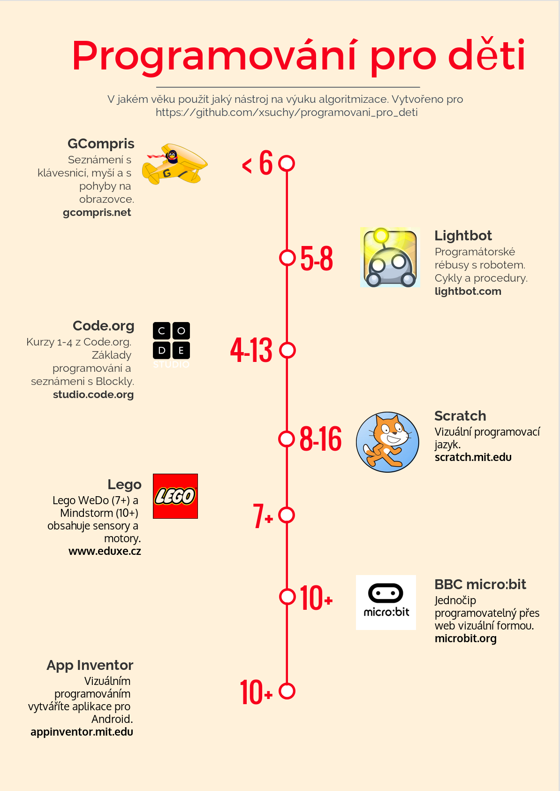

## Volnočasové kroužky

Bez záruky kvality:

* Brno
  * [Programování](http://www.krouzek-programovani.cz/)
  * [Robotárna](http://www.robotikabrno.cz/)
  * [Step Akademie](https://brno.itstep.org/)
* Praha
  * [Step Akademie](https://praha.itstep.org/)
* Lázně Toušeň
  * [Lázně Toušeň](https://www.programovanihrou.cz/)
* Šumperk
  * [Amavet](http://www.amavetsumperk.cz/index.php?vyber=430)
